# ラボ 2 – デバイスを Azure IoT Central に接続する

こちらのラボでは、Azure IoT Central のセットアップ、デバイス テンプレートの作成、そしてデバイスとして HummingBoard の追加を行います。このラボの終了時には、HummingBoard デバイスをクラウドで監視することが可能になります。

## 用意するもの

### ソフトウェア

* Web ブラウザー

## 1 - Azure IoT Central (IOTC) を展開する

### 1.1 - IOTC アプリケーションを作成する

1. [https://portal.azure.com/#create/Microsoft.IoTCentral](https://portal.azure.com/#create/Microsoft.IoTCentral) を開き、あらかじめ提供されている、ラボの資格情報を使ってログインします。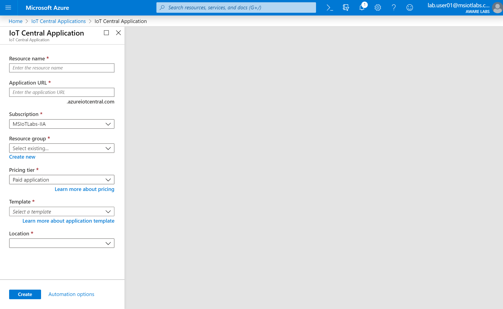

2. **\[New Application]** をクリックし、以下の設定を選択します。

| 名前| 値
|----------|----------
| Resource Name| `[choose a unique name]`
| Subscription| `MSIoTLabs-IIA`
| Resource Group| `msiotlabs-iia-userXX` (`XX` はユーザー番号)
| Template| `Custom Application`
| Region| `United States`

3. **\[Create]** をクリックしてアプリケーションを準備します。

4. アプリケーションが展開されるのを待ちます。通常、これは 1 分以内に完了します。続いて、`Go to Resource` ボタンを押します。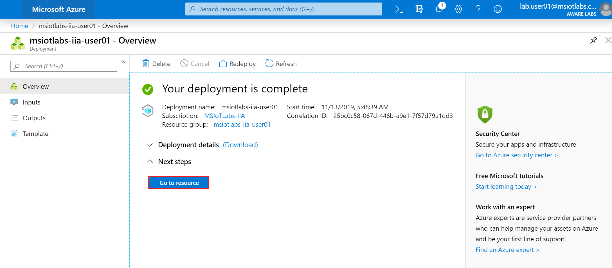

5. IoT Central アプリケーションの URL をクリックして、IoT Central アプリケーションを開きます。この URL は、2 番目の手順で指定した名前に対応したものとなります。[apps.azureiotcentral.com](https://apps.azureiotcentral.com/myapps) ポータルを利用してアプリケーションにアクセスすることもできます。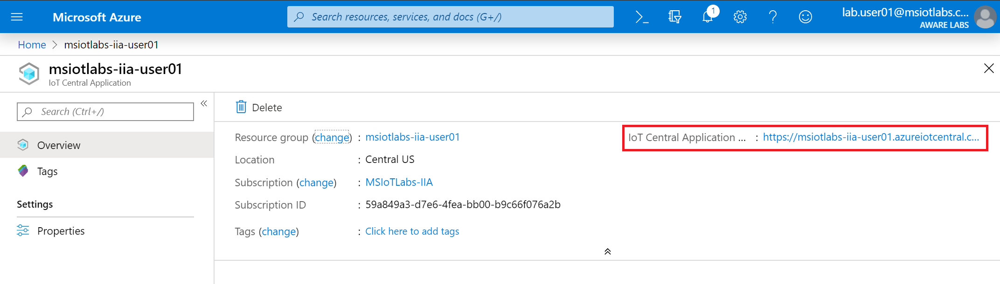

### 1.2 - デバイス テンプレートを作成する

1. \[Device Templates] に移動し、**\[New]** をクリックします。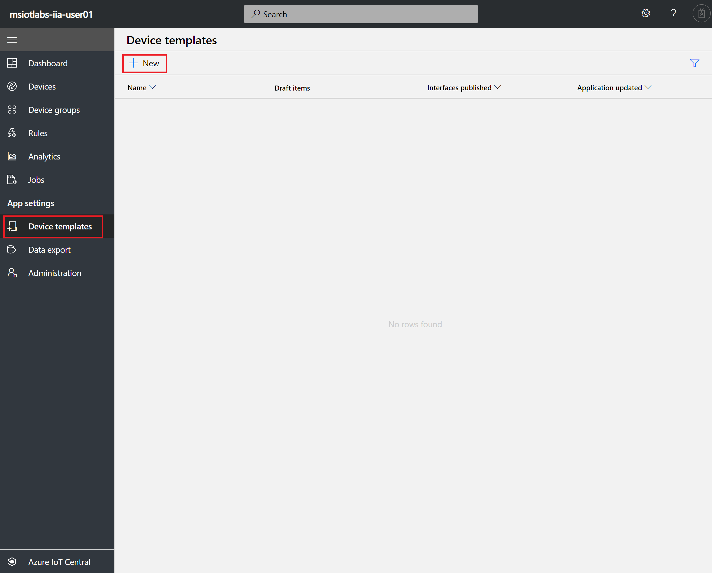

2. IoT Central では [Azure IoT デバイス カタログ] から既存のデバイス テンプレートをインポートすることもできますが、今回はデバイスを独自に作成していきます。**\[IoT Device]** をクリックします。続いて、ウインドウ下部の **\[Next: Customize]** ボタンをクリックします。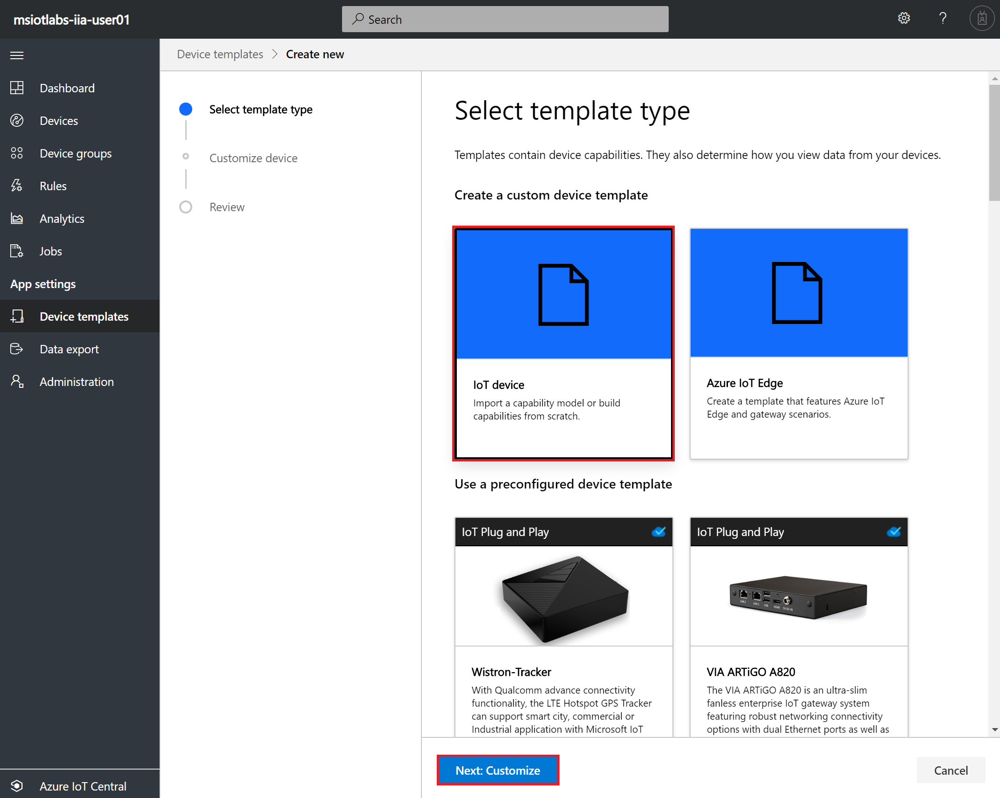

3. \[Gateway Device] チェックボックスが**オフ**になっていることを確認します。続いて  **\[Next: Review]** ボタンを押し、さらに **\[Create]** をクリックします。

4. デバイス テンプレートの名前欄に **SensorTile.box** と入力し、リターンキーを押します。続いて、**\[Import Capability Model]** をクリックします。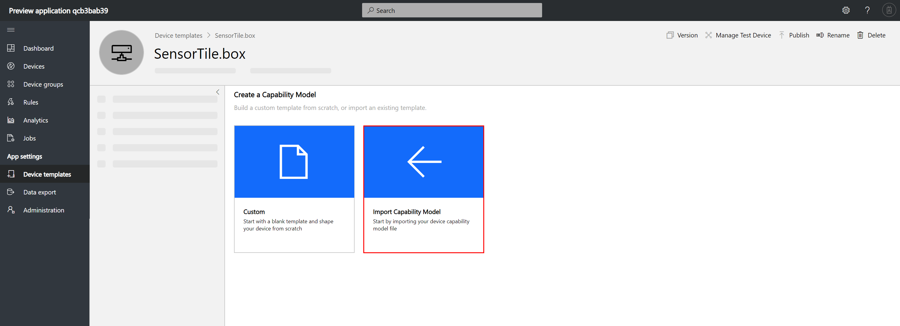

5. `C:\Labs\Content\src\Azure.IoTCentral\` フォルダーに移動し、`ST SensorTile.Box.json` という名前のファイルをアップロードします。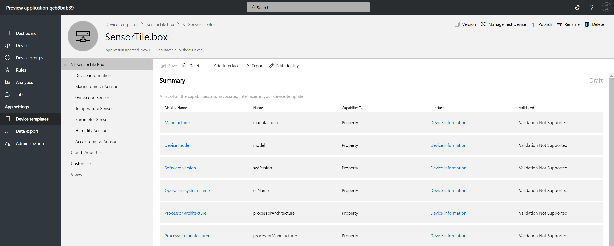

6. **\[Views]** をクリックしてから、**\[Generate Default Views]** をクリックします。画面上の項目には変更を加えず、もう一度 **\[Generate Default Views]** をクリックします。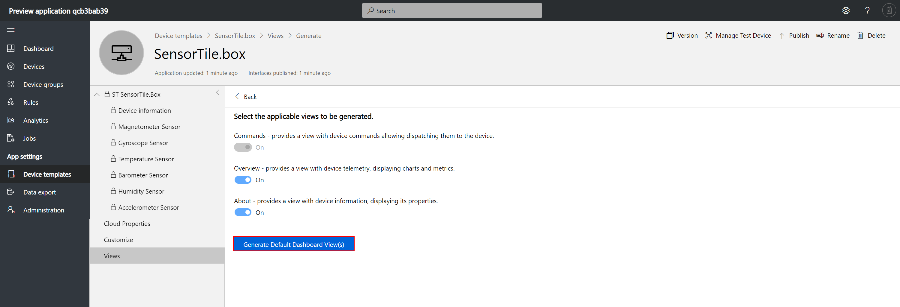

7. (右上にある) **\[Publish]** をクリックします。続いて、もう一度 **\[Publish]** をクリックして、処理を確定します。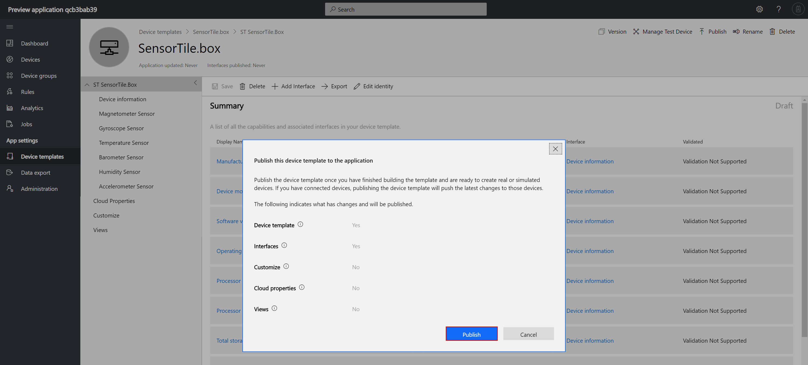

### 1.3 - テンプレートからデバイスを作成する

1. **\[Devices]** をクリックし、新しく作成したデバイス テンプレートを選択してから、**\[New]** をクリックします。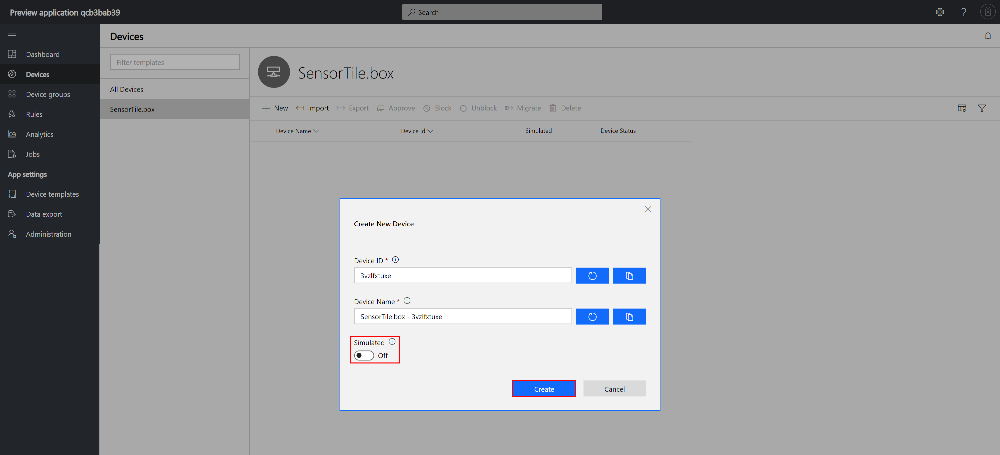

2. **\[Simulated]** トグルが**オフ**になっていることを確認してから、**\[Create]** をクリックします。

3. 新しく作成したデバイスをクリックして、デバイス ダッシュボードを確認します。まだ何のデータも表示されていないはずです。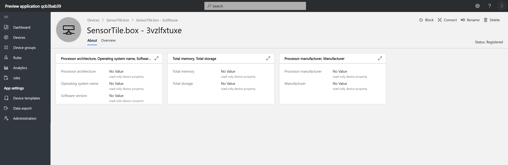

4. **\[Connect]** ボタンをクリックしてから、`Scope ID`、`Device ID`、`Primary Key` を記録します。これらは、Azure IoT Hub の Device Provisioning Service (DPS) 用の詳細情報です。デバイスをセットアップするために必要となります。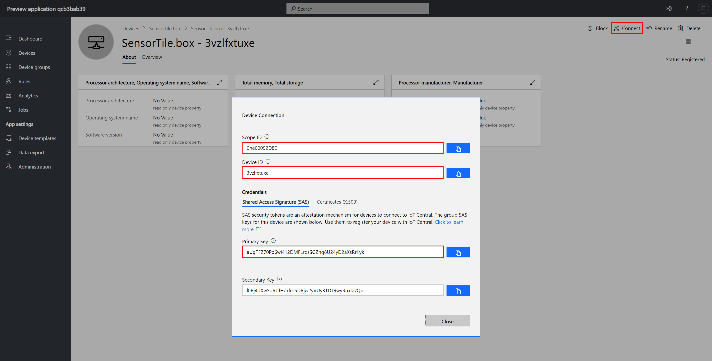

## 2 - デバイスを設定して IoT Central に接続する

### 2.1 - Azure IoT Hub 用のデバイス詳細を準備する

アプリケーションを IoT Hub に接続するには、接続文字列を生成する必要があります。これは **dps-keygen** などのコマンド ライン ツールを使って、プログラム的に実行することができます。

ここでは dpsgen.com という Web サイトを使って、接続設定を含んだ設定ファイルを、テスト用アプリケーションが利用できる形式で生成します。

1. ブラウザーのタブを開いて、[www.dpsgen.com/iia](https://www.dpsgen.com/iia) に移動します。

2. 先ほど収集した `Scope ID`、`Device ID`、`Primary Key` を入力し、**\[Generate JSON]** をクリックします。

3. tpmoverride.json というファイルがダウンロードされた場所に移動し、そのファイルを開きます。ファイルの内容が "null" で埋まっている場合は、dpsgen の Web サイトで接続文字列を生成する際に問題が生じたと考えられます。その場合は、もう一度やり直してみてください。それでも解決しないときは、[https://github.com/Azure/dps-keygen](https://github.com/Azure/dps-keygen) の方法を用いる必要があります。

4. コマンド プロンプトを管理者として開きます。

5. `tpmoveride.json` を HummingBoard へコピーするために、まず以下の 2 つのコマンドそれぞれの IP アドレスを自分の HummingBoard デバイスの IP アドレスで置き換え、次にコマンド プロンプト ウィンドウで 2 つのコマンドを順番に実行します。

```batch
net use \\<device ip address here>\c$ /USER:administrator
copy "%userprofile%\Downloads\tpmoverride.json" \\<device ip address here>\c$\Data\Users\DefaultAccount\AppData\Local\Packages\IoTLabs.TestApp.App_wqmbmn0a4bde6\LocalState /y
```

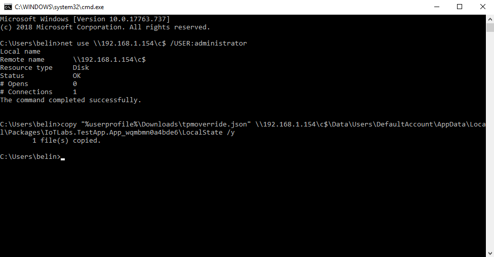

5. Visual Studio を使ってアプリケーションを停止させ、続いて再起動させます。起動後、Azure IoT が接続済みとして表示されているはずです。

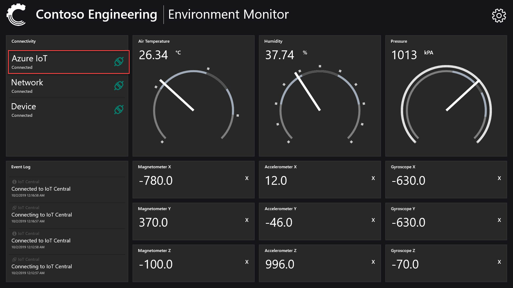

6. IoT Central に戻ると、ダッシュボードのデータも見えるようになっているはずです。

7. \[Devices] を選択し、自分のデバイスをクリックします。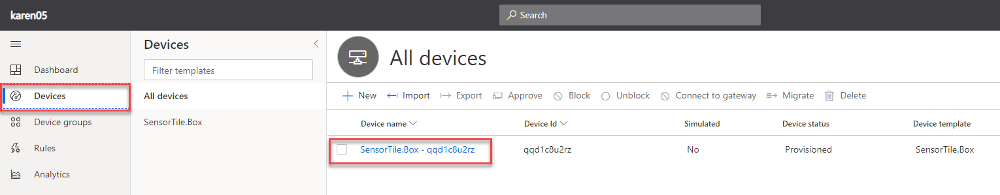

8. 続いて \[Overview] を選択すれば、デバイス ダッシュボードが表示されているのを確認できるはずです。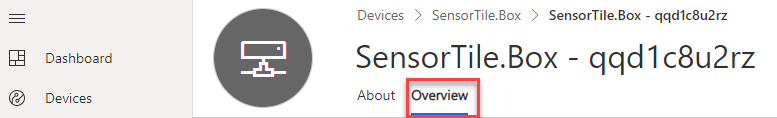

**補足：**ダッシュボードに "Waiting for data" と表示される場合は、アプリケーションと Azure とのセキュアな接続が確立していません。上記の手順をもう一度行って、tpmoverride ファイルをコピーしてください。