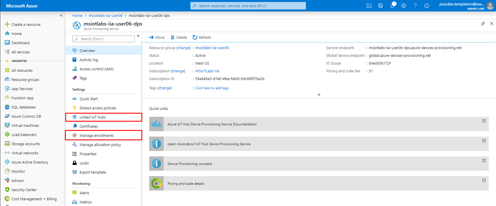
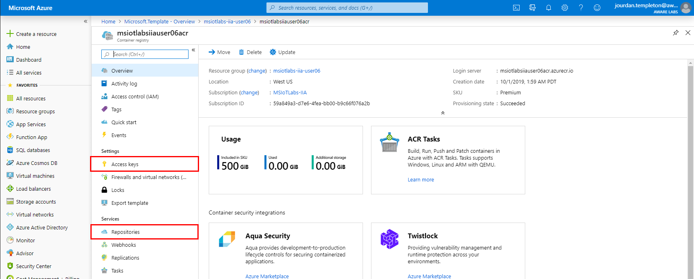

# ラボ 3 – Azure IoT Edge を Windows 10 IoT Enterprise に展開する

## 1 - Azure IoT のコンポーネントを展開、設定する

### 1.1 - Azure リソースのプロビジョニングを行う

マイクロソフトの IoT ソリューションすべての中心となるのが、Azure IoT Hub サービスです。IoT Hub はセキュアなメッセージング、デバイスのプロビジョニング、デバイス管理などの機能を提供します。

Azure Resource Manager テンプレート (ARM テンプレート) は、IoT Hub を利用している Azure 環境にも展開できます。

1. ブラウザーを開き、[Azure Portal (portal.azure.com)](https://portal.azure.com) に移動します。

2. あらかじめ提供されている、ラボの資格情報を使ってログインします。
**lab.user##@msiotlabs.com (## をラボのワークステーションの番号で置き換える。例えば 1 番なら、lab.user01@msiotlabs.com とする)**

3. 以下の \[Deploy to Azure] ボタンをクリックして、次回以降のラボに必要な Azure IoT コンポーネントを作成します。<br/><br/> <a href="https://portal.azure.com/#create/Microsoft.Template/uri/https%3A%2F%2Fraw.githubusercontent.com%2Fawaregroup%2FIIALab%2Fmaster%2Fsrc%2FAzure.ARM%2Fiia-azuredeploy.json" target="_blank" rel="noopener noreferrer">  </a>

4. ARM テンプレートを表示させて、作成されるコンポーネントを確認することもできます。
<a href="http://armviz.io/#/?load=https%3A%2F%2Fraw.githubusercontent.com%2Fawaregroup%2FIIALab%2Fmaster%2Fsrc%2FAzure.ARM%2Fiia-azuredeploy.json" target="_blank" rel="noopener noreferrer">  </a><br/><br/>

5. **\[Resource group]** からラボでの自分のユーザー番号に対応するものを選択し、**\[I agree]** をクリックして規約に同意し、**\[Purchase]** をクリックしてプロビジョニング プロセスを開始します。

6. プロビジョニング プロセスの完了を待ちます。

### 1.2 - リソースを確認する

1. 左側のアイコン メニューから、\[Resource Groups] をクリックします。

2. 自分のユーザー名に対応するリソース グループをクリックします。

3. 以下に挙げる種類のリソースが表示されることを確認してください。<br/>

* Container Registry
* Device Provisioning Service
* IoT Hub
* ストレージ アカウント
* Stream Analytics のジョブ

以上のコンポーネントが、あなたのデバイスが接続する IoT プラットフォームとなります。

## 2 - 各種のリソースについて知る

### 2.1 - IoT Hub

IoT Hub は、Azure 上のあらゆる IoT プロジェクトの中心となります。あなたの IoT Hub リソース **msiotlabs-iia-user##-iothub** を開いて、下の表に載っている各種のページを確認してください。

| コンポーネント| 説明
|----------|----------
| Shared Access Policies| IoT Hub ではセキュリティが特に重視されています。ここからは、IoT Hub の管理機能へのアクセス権を設定できます。
| IoT Devices| このデバイス リストから、IoT Hub に現在登録されているすべてのデバイスを確認し、それらを管理できます。各デバイスのメタデータ (デバイス ツインなど) を確認することもできます。
| IoT Edge| これは今回以降のラボで重要となるコンポーネントです。IoT Edge デバイスを IoT Devices と同様のやり方で管理できます。
| Message Routing| IoT Hub の中核となるのがメッセージング プラットフォーム、すなわち「デバイスからクラウドへ」、そして「クラウドからデバイスへ」メッセージを送信する機能です。メッセージ経路を通じて、デバイスのメッセージを他の Azure サービスへ転送することができます。このソリューションで設定されている経路によって、テレメトリを Time Series Insights へ流し込めるようになっています。

**アドバイス:** ラボの次の手順に備えるため、ナビゲーション リンク (画面中央上) からリソース グループ **msiotlabs-iia-user##** をクリックして、自分のリソース グループに戻っておきましょう。


### 2.2 - Device Provisioning Service (DPS)

Device Provisioning Service はあなたのリソース グループ、**msiotlabs-iia-user##** で見つかります (うまくいかないときは、前の手順の "アドバイス" を参照してください)。

DPS を利用すると、デバイスに組織固有のキーを埋め込めるようになります。このキーによって、デバイスは特定の IoT Hub への登録を初回ブート時に行えます。この機能により、デバイス開発者は容易に多数のデバイスを生産し、それらを一元的に管理された IoT Hub に登録させることができます。



| コンポーネント名| 説明
|----------|----------
| Linked IoT Hubs| DPS は、特定の IoT Hub にデバイスを登録する機能を持っています。展開済みのテンプレートには既存の IoT Hub に接続している DPS が含まれている、ということを確認できるはずです。
| Manage Enrollments| 登録済みのデバイスはこのリストに表示されます。この場所は、次回以降のラボでもう一度確認することになるかもしれません。

**アドバイス:** 先ほどと同じように、次の手順に備えるため、ナビゲーション リンク (画面中央上) からリソース グループ **msiotlabs-iia-user##** をクリックして、上の階層に戻っておきましょう。

### 2.3 - Stream Analytics (エッジ)

Stream Analytics は、Azure におけるフルマネージドの「サービスとしてのプラットフォーム (PaaS)」サービスです。多数のソースからの大量の高速ストリーミング データを同時に分析および処理できるように設計されています。クラウド側とエッジ側の両方で利用できます。


| コンポーネント名| 説明
|----------|----------
| Query| Stream Analytics では、データ ストリームの途中地点で適用するクエリを編集できます。次回以降のラボで、このクエリを修正することになります。

エッジ版の Stream Analytics では、このサービスをエッジ デバイス上のコンテナー内で実行できます。

**アドバイス:** 次の手順に備えるため、先ほどと同じように、もう一度リソース グループ **msiotlabs-iia-user##** に戻っておきましょう。

### 2.4 - Container Registry

Container Registry は、プライベートな Docker コンテナー レジストリであり、コンテナーのプッシュ先として使用できます。IoT Edge と組み合わせて、エッジ デバイスで利用するコンテナーを保存することもできます。非公開のコードを、公開レジストリではなく、自分用のコンテナー レジストリで保護し続けることができます。



| コンポーネント名| 説明
|----------|----------
| Repositories| Container Registry にプッシュされているコンテナーやタグを含むリポジトリが、すべてリストされています。
| Access Keys| Container Registry への接続に使われるセキュリティ キーがリストされています。これについては、後で取り上げます。

## 3 - 共通リソースについて知る

今回のラボで共通リソースのプロビジョニングを行ったことにより、それをラボのユーザー全員が共有できるようになりました。リソース グループのリストに戻り、リソース グループ \[common] をクリックしてください。**アドバイス:** Azure の上部にある検索バーに "common" と入力してもよいでしょう。


ここで表示されるリソースによって、ラボの各 IoT Hub インスタンスのすべてから送られてくるデータを単一の IoT データ ストリームとして統合し、Time Series Insights で処理および表示することが可能となります。

### 3.1 - Cognitive Services

Cognitive Services は、トレーニング済みの機械学習モデルを各種取りそろえたものです。それらのモデルは、ユーザー独自のアプリケーションやサービスに容易に組み込むことができます。Custom Vision は、そういった機械学習モデル サービスの一例です。

Custom Vision を使えば、Azure の計算インフラを活用して、ユーザー独自の Computer Vision モデルを迅速かつ容易にトレーニングできるようになります。

### 3.2 - Time Series Insights

1. Time Series Insights 環境をクリックします。

2. \[Go To Environment] からユーザー インターフェースを表示させます。データはここに表示されることになります。今のところは何のデータも**見えません**が、次回以降のラボでは、エクササイズの結果を確認するために、このページに戻ってくることになります。

## 4 - ラボの PC をエッジ デバイスとして設定する

### 4.1 - IoT Hub でデバイスを作成する

1. デバイス上に記載されている、ラボの PC の番号をメモします。例えば、1 番なら **LAB.USER01** というように変換します。

2. ブラウザーを開き、[Azure Portal (portal.azure.com)](https://portal.azure.com) に移動します。あらかじめ提供されている、ラボの資格情報を使ってログインします。

3. Azure Portal のホームページから **\[Resource groups]** を選択します。

4. リストからリソース グループ **msiotlabs-iia-user##** を選び、**IoT Hub** を選択します (これは今回のラボの手順 2.1 で確認したものと同一の IoT Hub リソースです)。

5. **Automatic Device Management** という見出しの下にある IoT Hub のメニューから、**\[IoT Edge]** をクリックします。


6. ページ上部にある **\[Add an IoT Edge device]** をクリックします。

7. (先ほどメモした) ラボの PC の名前をデバイス ID として入力します。その他の設定は既定値のままにして、**\[Save]** をクリックします。

8. **\[Refresh]** をクリックすると、新しく作成したデバイスがリストに表示されるはずです。

9. **デバイス ID** (赤い丸) と **Iot Hub 名** (赤い四角) をメモします。これらの情報は、以降の手順で参照する必要があります。

10. デバイスを選択して、**プライマリ接続文字列**をメモします。この情報は次の手順で使用するため、ページを開いたままにするか、もしくは簡単に参照できるよう、情報をデスクトップ上のドキュメントに保存しておいてください。

### 4.2 - Azure CLI を使って IoT デバイスをセットアップする


. {Invoke-WebRequest -useb aka.ms/iotedge-win} | Invoke-Expression; `
Uninstall-IoTEdge

**注意:** 以降の手順では、ラボの PC が再起動されます。開いているドキュメントがあれば、今のうちに保存しておくとよいでしょう。

1. ラボの PC でスタート メニューを開き、**PowerShell** と入力してから、**\[Run as Administrator]** をクリックします。  


2. このアプリがデバイスに変更を加えることを許可しますか と表示された場合は、**\[Yes]** をクリックします。

3. 以下のコマンドを実行して、Azure IoT Edge ランタイムをデバイスにインストールします。

```powershell
. {Invoke-WebRequest -useb aka.ms/iotedge-win} | Invoke-Expression; Deploy-IoTEdge
```

4. 確認を求められたら、**Y** を 押します。2 度目の入力がある場合、再起動が実行されます。

5. システムが再起動したら、PowerShell のセッションをもう一度管理者として開きます。

6. 以下のコマンドを実行して、Azure IoT Edge ランタイムを構成します。

```powershell
. {Invoke-WebRequest -useb aka.ms/iotedge-win} | Invoke-Expression; Initialize-IoTEdge
```

7. 入力を求められたら、前の手順で得たデバイス接続文字列を、SharedAccessKey を含めて入力します。

### 4.3 - Docker ラボ環境を準備する

1. PowerShell ウィンドウを**管理者として**開きます (PowerShell という項目を右クリックし \[Run as Administrator] を選択)。続いて、キャッシュされたバージョンのベース コンテナーを利用してインターネットの利用帯域を削減するために、以下のコマンドを実行します。

```powershell
docker load -i C:\Labs\Docker\azureiotedgeagent.tar
docker load -i C:\Labs\Docker\azureiotedgehub.tar
```

### 4.4 - インストールの成功を確認する

次の PowerShell コマンドを実行して、IoT Edge の状態を確認します。実行中と表示されるはずです。

```PowerShell
Get-Service iotedge
```

次の PowerShell コマンドを実行して、過去 5 分間のサービス ログを確認します。IoT Edge ランタイムのインストールを終えたばかりであれば、Deploy-IoTEdge の実行から Initialize-IoTEdge までの間に、一連のエラーが記録されているかもしれません。これらのエラーは想定内のものです。このサービスは、構成される前に起動しようとするためです。

```PowerShell
. {Invoke-WebRequest -useb https://aka.ms/iotedge-win} | Invoke-Expression; Get-IoTEdgeLog
```

次の PowerShell コマンドを実行して、構成およびネットワーキングに関する最も一般的なエラーの自動チェックを実行します。

```PowerShell
iotedge check
```

次の PowerShell コマンドを実行して、実行中のモジュールを一覧表示させます。新規インストールの後には、**edgeAgent** という 1 つのモジュールのみが実行中として表示されているはずです。各種の IoT Edge モジュールを初めて展開したときから、その他のシステム モジュールである **edgeHub** もデバイス上で起動するようになります。

```PowerShell
iotedge list
```