# ラボ 4 – Azure Stream Analytics を使ってエッジでデータを処理する

今回のラボでは、Azure Stream Analytics を Windows 10 IoT Enterprise 上の Azure IoT Edge と組み合わせて使う方法について紹介します。

## 1 - 仮想の温度センサーを展開する

### 1.0 - Docker ラボ環境を準備する

1. PowerShell ウィンドウを**管理者として**開きます (PowerShell という項目を右クリックし \[Run as Administrator] を選択)。続いて、キャッシュされたバージョンのベース コンテナーを利用してインターネットの利用帯域を削減するため、以下のコマンドを実行します。

```powershell
docker load -i C:\Labs\Docker\temperaturesimulator.tar
```

### 1.1 - Azure CLI を使ってモジュールを展開する

1. スタート メニューを開いて **PowerShell** と入力し、続いて **\[Run as Administrator]** をクリックします。

2. 以下のコマンドを使って Azure CLI にログインします。

**補足:** ブラウザーへのログインを求められた場合は、ラボの資格情報を使用してください。

```powershell
az extension add --name azure-cli-iot-ext
az login
```

3. 以下のように、アカウントを適切なサブスクリプションに設定してください。

```powershell
az account set --subscription 'MSIoTLabs-IIA'
```

4. 以下のコマンドを実行してください。その際、**\[device id]** と **\[hub name]** をそれぞれの内容 (ラボ 3 で IoT Hub をセットアップした際にメモしたもの) で置き換えてください 。

```powershell
az iot edge set-modules --device-id [device id] --hub-name [hub name] --content "C:\Labs\Content\src\IoTLabs.IoTEdge\deployment.template.lab04.win-x64.json"

#注意 - 大文字と小文字を区別して入力してください。入力内容は、Azure Portal 内の表示と正確に一致させる必要があります。また、上記コード内の角括弧は忘れずに削除してください。以下に例を示します。
#az iot edge set-modules --device-id labuser01 --hub-name msiotlabs-iia-user01-iothub --content "C:\Labs\Content\src\IoTLabs.IoTEdge\deployment.template.lab04.win-x64.json"
```

### 1.2 - IoT Edge デバイスへのデプロイを確認する

モジュールのデプロイはすぐに完了しますが、デバイスへの変更が有効となるまでには 5 ～ 7 分かかることがあります。つまり、新しいコンテナーがロードされるまでには、しばらく時間がかかる場合があるということです。以下のコマンドを使用すると、SimulatedTemperatureSensor コンテナーの状態を確認できます。

1. Azure IoT Edge ランタイムのインストールを検証するため、引き続き PowerShell で、以下のコマンドを使用してください。

```powershell
iotedge check
```

2. 次の PowerShell コマンドを実行して、現在のモジュールを確認してください。

```powershell
iotedge list
```

3. 次のコマンドを実行して、仮想の温度センサーが出力したログを確認してみてください。

```powershell
iotedge logs SimulatedTemperatureSensor
```

デバイスが 5 秒おきに架空の温度データを受け取っていて、そこではマシンの温度が徐々に上昇していることになっているはずです。

### 1.3 - デバイスからクラウドへのメッセージを監視する

1. IoT Hub に送られている、デバイスからクラウドに向けた (D2C の) メッセージを監視するため、以下のコマンドを入力してください。その際、**\[device id]** と **\[hub name]** は、それぞれ[手順 1.1](#11---cloud-setup) と同じ内容で置き換えてください。

```powershell
az iot hub monitor-events --device-id [device id] --hub-name  [hub name]

#注意 - 上記コード内の角括弧は忘れずに削除してください。以下に例を示します。
#az iot hub monitor-events --device-id device1 --hub-name  msiotlabs-iia-user06-iothub
```

2. このコマンドを初めて実行する場合、依存関係を更新するためにキー入力を求められます。**Y** を入力してから、**Enter** キーを押してください。

このコマンドによって、SimulatedTemperatureSensor コンテナーから IoT Hub へと送られているデータを監視できます。データの表示が始まるまでに、少し時間がかかる場合があります。

**補足:** Ctrl-C を押して監視を停止してください。これからすぐに、別の PowerShell コマンドを実行していきます。

## 2 - Azure Stream Analytics の Edge ジョブを設定する

### 2.0 - Docker ラボ環境を準備する

1. PowerShell ウィンドウを**管理者として**開きます (PowerShell という項目を右クリックし \[Run as Administrator] を選択)。続いて、キャッシュされたバージョンのベース コンテナーを利用してインターネットの利用帯域を削減するため、以下のコマンドを実行します。

```powershell
docker load -i C:\Labs\Docker\streamanalytics.tar
```

### 2.1 - Azure Stream Analytics の Edge ジョブに移動する

1. [Azure Portal (https://portal.azure.com)](https://portal.azure.com) で、リソース グループ **msiotlabs-iia-user##** を開きます。

2. **Stream Analytics ジョブ** のリソースを開きます。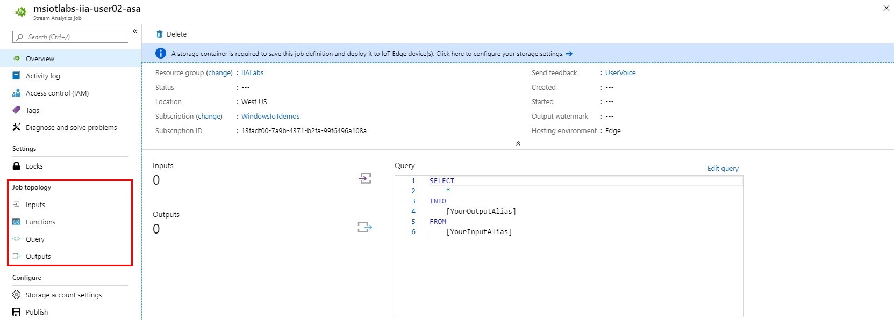

### 2.2 - インプットを追加する

1. Stream Analytics メニューの **Job topology** という見出しの下から、**\[Inputs]** を選択します。

2. **\[Add stream input]** を選択し、続けて **\[Edge Hub]** を選びます。

3. **\[Input Alias]** を **"temperature"** に設定し、残りの項目は規定値のままにしておきます。

4. **\[Save]** をクリックします。

### 2.3 - アウトプットを追加する

1. 左側メニューの **Job topology** という見出しの下から、**\[Outputs]** を選択します。

2. **\[Add]** を選択し、続けて **\[Edge Hub]** を選びます。

3. **\[Output Alias]** を **"alert"** に設定し、残りの項目は既定値のままにしておきます。

4. **\[Save]** をクリックします。

### 2.4 - クエリを追加する

1. 左側メニューの **Job topology** という見出しの下から、**\[Query]** を選択します。

2. 既存の Select 文を以下のものと置き換えます。

```sql
SELECT  
    'reset' AS command,
    'lab04' AS source
INTO 
   alert 
FROM 
   temperature TIMESTAMP BY timeCreated 
GROUP BY TumblingWindow(second, 30) 
HAVING Avg(machine.temperature) > 26
```

Stream Analytics を使うと、データ ストリームに複雑なロジックを適用できます。上記のクエリによって、平均温度が 26 度を 30 秒以上超えた場合に、デバイスが **"reset"** メッセージを送信できるようになります。

3. **\[Save]** をクリックします。

## 3 - Azure Stream Analytics Edge ジョブの利用に向けて IoT Edge を設定する

### 3.1 - Azure Portal を使ってモジュールを展開する

1. [Azure Portal (https://portal.azure.com)](https://portal.azure.com) で、リソース グループ **msiotlabs-iia-user##** を開きます。

2. **IoT Hub** リソースを開き、**IoT Edge** に移動します。続いて、ラボ 3 で作成したデバイスを選択します。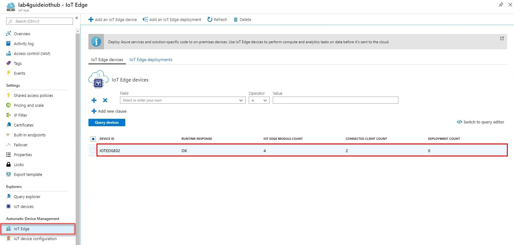

3. **\[Set Modules]** をクリックします。  
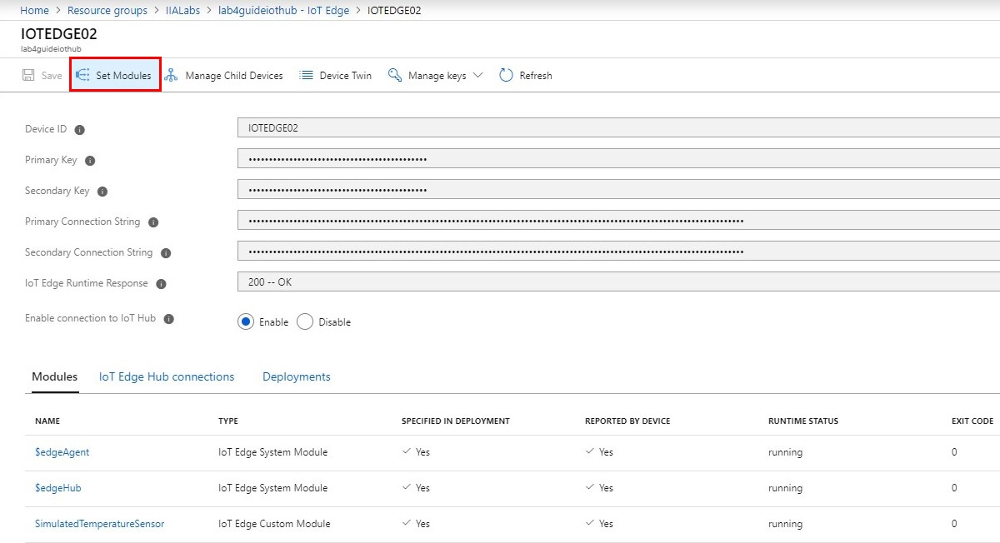

4. **Deployment Modules** という見出しの下から **\[+ Add]** をクリックし、**\[Azure Stream Analytics Module]** を選択します。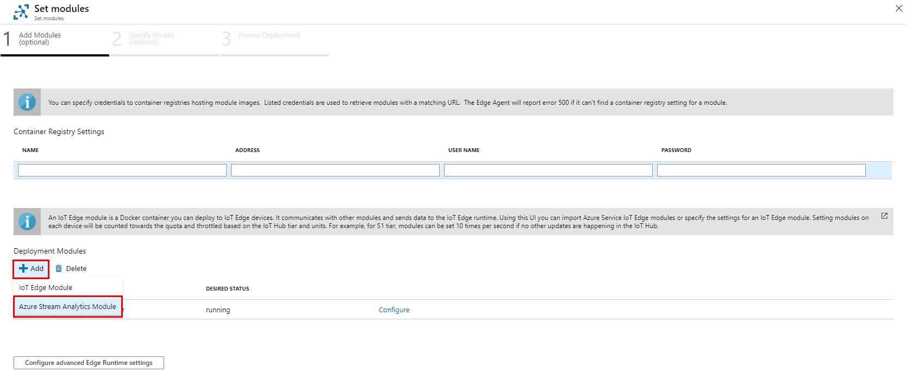

5. \[Subscription] を **MSIoTLabs-IIA** に、\[Edge Job] を **siotlabs-iia-user##-streamanalytics** に設定します。続いて **\[Save]** をクリックします。

**補足:** 保存ボタンを表示させるために、**\[Edge job]** ボックスをクリックする必要があるかもしれません。

6. モジュールのロードが済んだら **\[Configure]** を選択し、**NAME** フィールドの内容をメモします。このモジュール名は次の手順で利用します。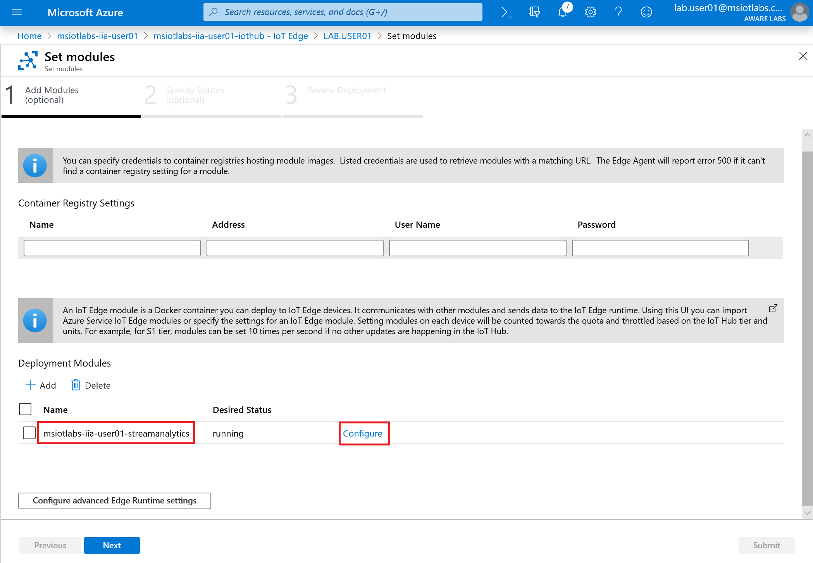

7. **\[Save]** をクリックし、続けて **\[Next]** を選択します。

### 3.2 - 経路を選択する


1. 既存の Routes を削除して Routing Table を下記のテーブルの値を用いて画像のように編集します。**[module name]** をラボ用PCのデスクトップにある **notes** ファイルにある名前に書き換えていただく必要があります. **[module name]** の変更が必要なポイントが 3つあります。


|Name     |Value  |
|---------|---------|
|telemetryToCloud     | FROM /messages/modules/SimulatedTemperatureSensor/* INTO $upstream        |
|alertsToCloud     | FROM /messages/modules/**[module name]**/* INTO $upstream        |
|alertsToReset     |FROM /messages/modules/**[module name]**/* INTO BrokeredEndpoint("/modules/SimulatedTemperatureSensor/inputs/control")         |
|telemetryToAsa     | FROM /messages/modules/SimulatedTemperatureSensor/* INTO BrokeredEndpoint("/modules/**[module name]**/inputs/temperature")        |

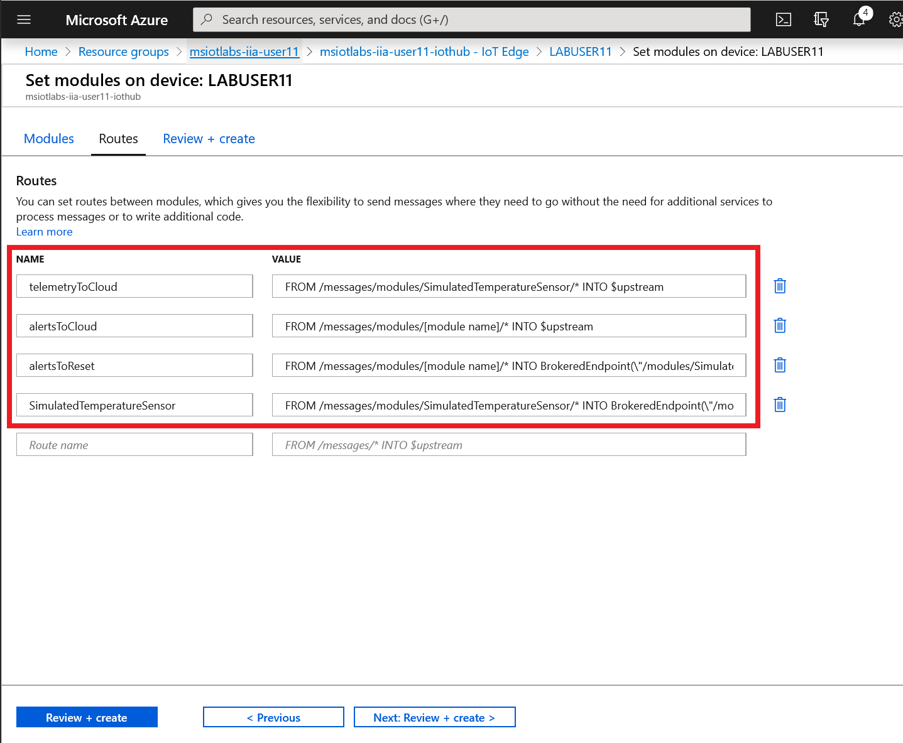

2. Select **Next:Review + create**, then **Create**

### 3.3 - IoT Edge デバイスへの展開を確認する

モジュールの展開はすぐに完了しますが、デバイスへの変更が有効となるまでには 5 ～ 7 分かかることがあります。1 つ前の手順で設定した Azure Stream Analytics モジュールが、自分のデバイスでロードされているか確認してみましょう。

1. スタート メニューを開いて **PowerShell** と入力し、続いて **\[Run as Administrator]** をクリックします。

2. 次のコマンドを使って、現在実行中のモジュールを調べます。

```powershell
iotedge list
```

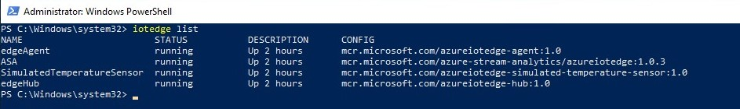

3. 次のコマンドを実行して、仮想の温度センサーが出力したログを確認してみてください。

```powershell
iotedge logs SimulatedTemperatureSensor
```

マシンの温度が、しきい値である 26 度を 30 秒間以上超えるまで上昇していくのを確認できるはずです。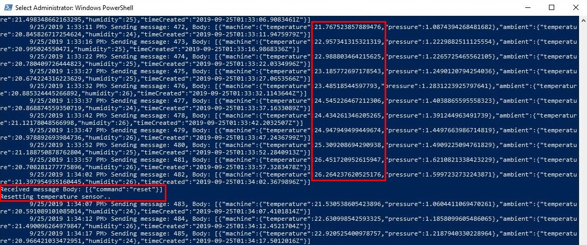

4. SimulatedTemperatureSensor がデータの出力を停止した場合は、以下のようにリセットして、再始動させることができます。

```powershell
iotedge restart SimulatedTemperatureSensor
```

### 3.4 - IoT Hub の経路を有効にする

1. Azure Portal 内の IoT Hub の設定に戻ります。

2. **\[Message Routing]** をクリックします。

3. 既存の経路を選択し、**\[Enable]** をクリックします。

4. 変更を保存します。

この手順によって、共通のリソース グループから確認できる Time Series Insights へテレメトリを流し込めるようになります。

## 4 - Azure Time Series Insights (TSI)

### 4.1 - Time Series Insights でデータを可視化する

このラボのシリーズでは、多種多様なストリーミング ソースからのデータを収集、処理し、単一のデータ プラットフォームに集約する方法を実演していきます。Azure Time Series Insights (TSI) は、時系列データの大量収集と可視化を実現します。

1. Azure Portal を開いて、リソース グループ **"common"** に移動します。

2. リソース **\[msiotlabs-iia-tsi]** をクリックして、TSI の詳細情報を確認します。

3. **\[Go to environment]** をクリックして、TSI ダッシュボードに移動します。

4. 左の欄から、自分のラボのユーザー名とラボ番号を見つけます。例えば "**LAB.USER30 LAB04**" を探して、このデバイスをクリックし、**\[Show temperature]** を選択します。  
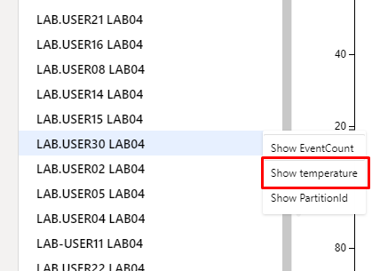

### 4.2 - 期間を選択する

**時間選択パネルを使用する**

1. 画面上部に、現在選択中の期間を表すバーが表示されるはずです。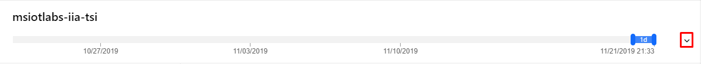

2. これは、右側にある小さな下向き矢印を使って広げることができます。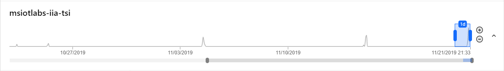

3. 下図のようにグラフの中で青色のボックスをドラッグしたり、移動させたりして、期間を変更してみてください。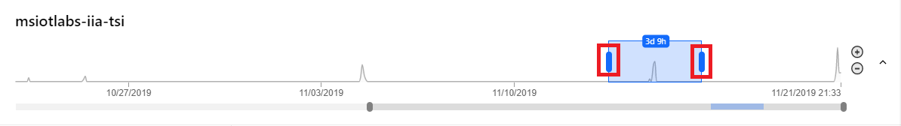

4. グラフのとがっている箇所は、TSI がデータを受信した時点を表しています。

**期間セレクターを使用する**

1. TSI の右上から、**Timeframe** という文字の隣にある **\[カレンダー] アイコン**をクリックします。  
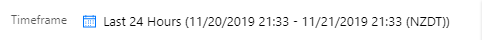

2. このメニューを使用して、ある一定の期間を選択できます。  
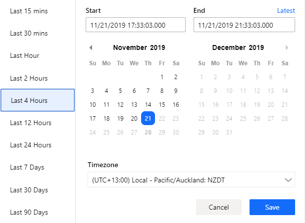

3. **過去 4 時間**を選択し、今日のラボで発生したデータを確認してみましょう。

### 4.2 - 複数のソースを比較する

1. 左の欄から他のラボ ユーザーのデバイスを選択し、**\[Show temperature]** を選びます。

2. そのユーザーから TSI に送られているデータがあれば、グラフの線が 2 本表示されるはずです。データを送っているユーザーが見つかるまで、選択を続けてみてください。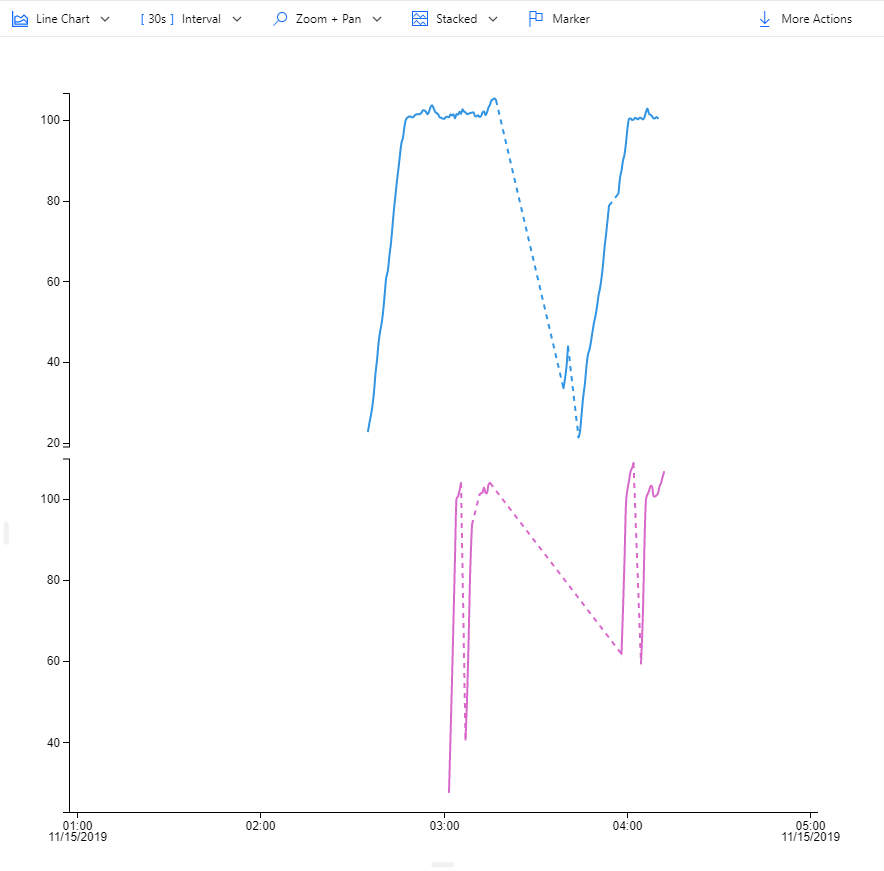

3. 追加した各ソースは、画面下部から確認できます。  
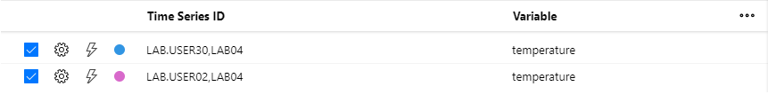

4. **\[Zoom + Pan]** メニューのオプションを使って、グラフが見やすくなるまで拡大します。

5. **\[Stacked]** をクリックして、それを **\[Shared]** または **\[Overlap]** に変更し、グラフを同じ軸の上に重ねて表示させてみましょう。

6. **\[Interval]** をクリックして、特定の間隔のデータを TSI がどのように集計するか確認してみましょう。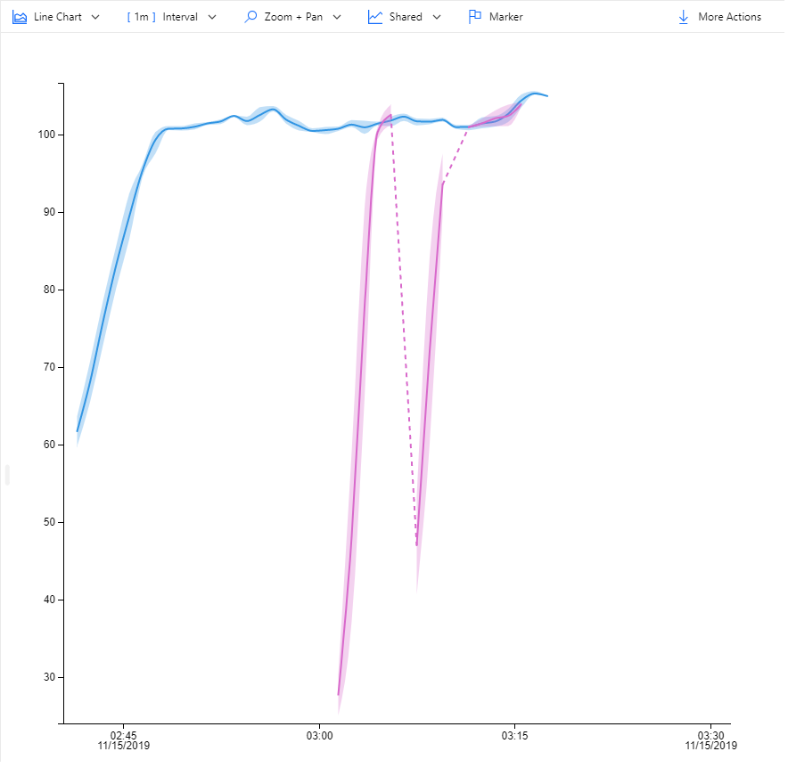

7. **\[Marker]** ボタンを使って、選択したソースすべての特定時点のデータを比較します。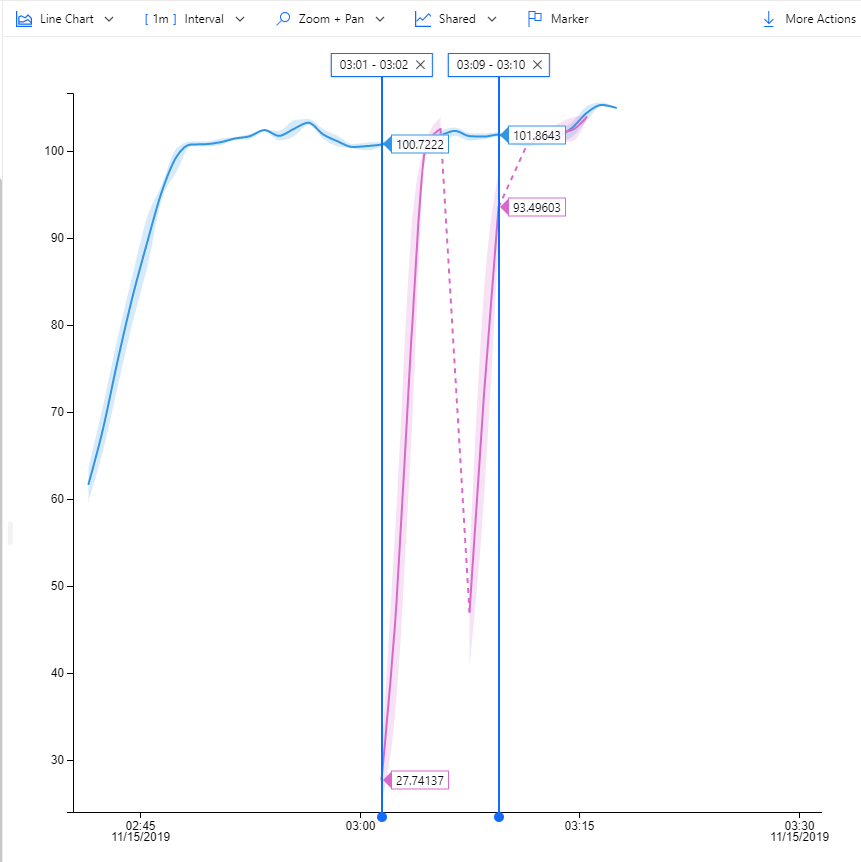

### 4.3 - イベントを調査する

1. グラフ上でマウスをクリックおよびドラッグして、調べてみたい領域を選択します。続いて、**\[Explore Events]** をクリックします。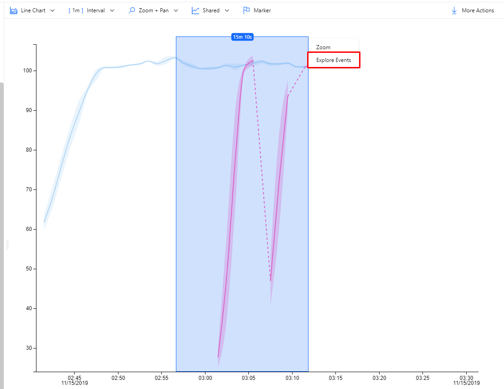

2. ここから、選択した範囲に含まれている個々のイベントを確認できます。また、このデータを CSV ファイルとしてエクスポートし、さらなる処理に利用することもできます。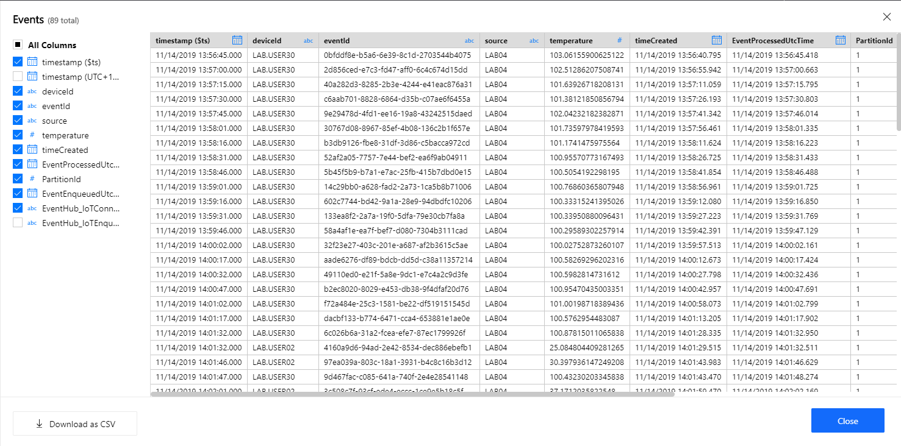