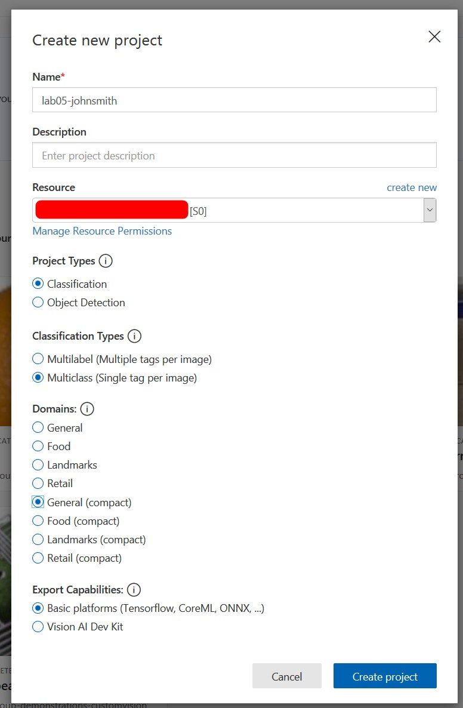
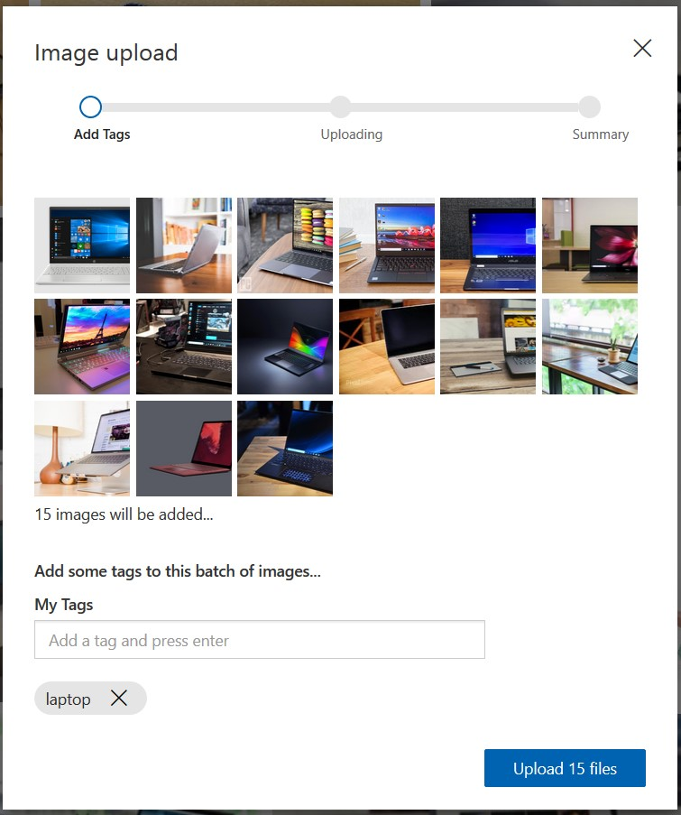
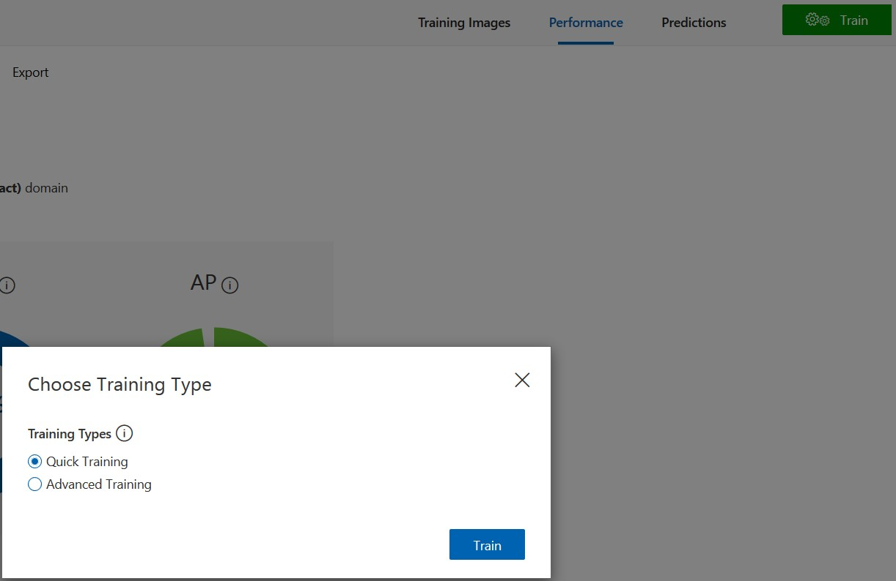
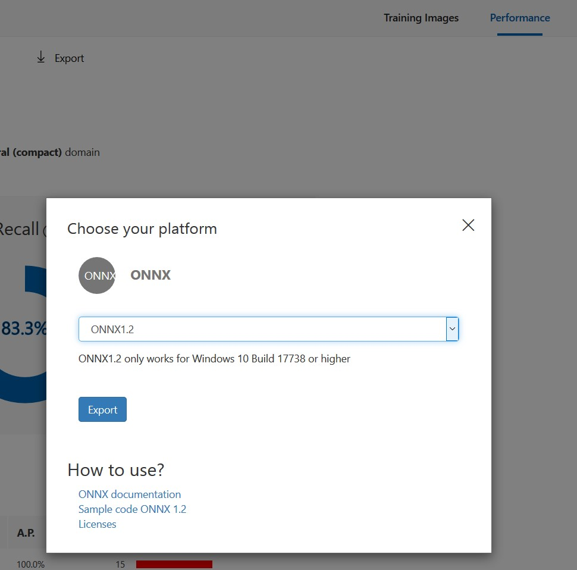
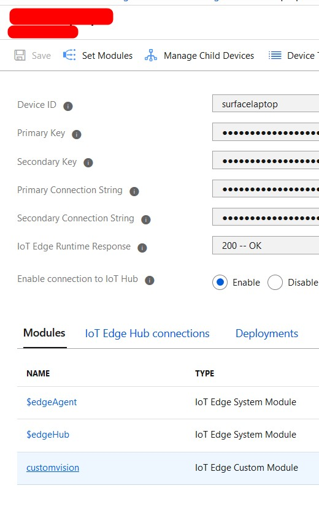
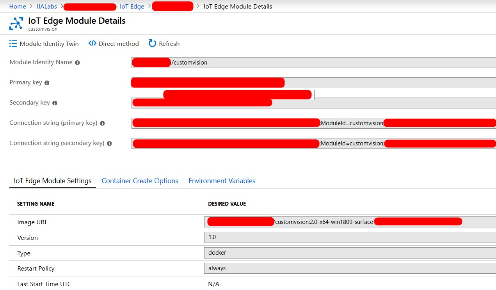

# ラボ 5 – Computer Vision ソリューションを構築してエッジに展開する

こちらのラボでは、Azure Custom Vision サービスを使って、画像分類用の機械学習 (ML) モデルをトレーニングします。このモデルを使って、ラボ用 PC のフォルダーから画像を取得する .NET Core アプリケーションを作成する予定です。このアプリケーションは、それから Windows ML を使って画像を分類し、続いてその結果を Azure IoT Hub に送信します。あなたはこのアプリケーションを Azure IoT Edge コンテナーに展開し、さらにそれを Azure IoT Edge を使って元のラボ用 PC に展開することになります。最後に、Time Series Insights を使って結果を可視化する予定です。

## 事前準備

このラボを開始する前に、展開用マシンで以下のページを開いておいてください。

1. この手順説明ページ

2. [Custom Vision のポータル](https://www.customvision.ai/)。ブラウザーのタブで開き、ログインしておいてください。

3. [Time Series Insights エクスプローラー](https://insights.timeseries.azure.com/)。ブラウザーの別のタブで開き、こちらにもログインしておいてください。

## 1 - Custom Vision

### 1.1 - トレーニング用画像を撮影する

1. ラボの開発用 PC のカメラ アプリを使って、オブジェクトの写真を 1 種類につき少なくとも 5 枚ずつ撮ってください (3 種類のオブジェクトそれぞれについて写真を 5 枚ずつとし、全部で 15 枚撮影するとよいでしょう)。  背景その他は、どのようになっていても構いません。
   * それらの写真をコンピューターに保存します。
   * それぞれのオブジェクトに対応した写真すべてを、オブジェクトにちなんだ名前のフォルダーに入れて整理します。こうしておくと、アップロードが簡単になります。

### 1.2 - Custom Vision の画像分類プロジェクトを作成する

1. [Custom Vision のポータル](https://www.customvision.ai/)にログインします。

2. 新しいプロジェクトを作成します。

3. プロジェクトを以下のように設定します。
   
   | フィールド| 値
   |----------|----------
   | Name| 固有の名前を入力
   | Description| 空白のまま
   | Resource| リスト内の既存の項目を選択
   | Project Types| Classification
   | Classification Types| Multiclass (Single tag per image)
   | Domains| General **(compact)**
   | Export Capabilities| Basic platforms

   **補足:** Export Capabilities が表示されていない場合は、Domain が General (compact) に設定されていることを確認してください。

4. 入力した詳細情報がすべて正しいことを確認してください。

5. **\[Create project]** をクリックします。

### 1.3 - トレーニング用データをアップロードしタグ付けする

1. \[Add image] ボタンをクリックして、オブジェクトの種類ごとに画像を一括アップロードします。
   
   * オブジェクト 1 の画像をすべてアップロードし、"オブジェクト 1" というタグを付けます。次にオブジェクト 2 の画像をすべてアップロードし、"オブジェクト 2" というタグを付け、以下同様に続けます。Ctrl キーを押したまま同じオブジェクトの複数の写真を選択すれば、すべての写真に同一のタグが付けられます。
   * 1 種類のオブジェクトの全画像をアップロードしたタイミングで、毎回、タグを指定します。

2. 以下は、一括アップロードと画像のタグ付けの例です。

### 1.4 - モデルをトレーニングする

1. **\[Train]** ボタン (右上の緑色のボタン) をクリックします。

2. **\[Quick Training]** オプションを選択します。

3. **\[Train]** をクリックします。

4. モデルをトレーニングする際の画面例を以下に示します。

### 1.5 - モデルをテストする

1. **\[Quick Test]** を選択して、モデルをテストします。

2. PC のカメラ アプリを使って、いずれかのオブジェクトの写真を新たに 1 枚撮影します。

3. 撮影した写真をアップロードして、それが正しく予測されたか確かめます。

### 1.6 - モデルをエクスポートする

1. ポータル内の \[Performance] タブに切り替えます。

2. **\[Export]** をクリックします。

3. タイプとして **ONNX** を選択します。

4. 選択可能となっている場合は、バージョンとして **ONNX1.2** を選びます。

5. \[Export] をクリックします。

6. Custom Vision によるエクスポートの準備が整ったら、**\[Download]** をクリックします。

7. ZIP 形式フォルダーを探して、右クリックから **\[すべて展開]** を実行します。

**アドバイス:** PC のダウンロード フォルダーを参照しましょう。

1. **model.onnx** のファイル名 を **CustomVision.onnx** に変更します。

## 2 - モデルを C# .NET アプリケーションにパッケージングする

### 2.1 - モデル ファイルを取得する

1. モデル ファイル CustomVision.onnx をダウンロード ディレクトリからラボのディレクトリ **C:\\Labs\\Content\\src\\IoTLabs.CustomVision** にコピーします。元からあった onnx ファイルに上書きしてください。

### 2.2 - 画像を追加する

1. **C:\\images** に移動し (このフォルダーがなければ作成してください)、モデルに評価させたい新しい画像をいくつか追加します。
   **補足:** 画像は .jpg ファイルでなければなりません。また、サブフォルダーに置いては**いけません** (C:/images/sub/image.jpg は不可)。

### 2.3 - サンプルをビルド & テストする

1. コマンド プロンプト ウィンドウを開き、以下の 4 行のコマンドを**順番に**入力します。機械学習モデルを利用して、`C:/images` フォルダー内の画像をテスト データとして使用するアプリケーションが、このコマンドによってビルドおよび実行されます。

```
cd C:\Labs\Content\src\IoTLabs.CustomVision
dotnet restore -r win-x64
dotnet publish -c Release -o ./release -r win-x64 --self-contained true
dotnet run -i --model=CustomVision.onnx
```

**出力の例**

```
4/24/2019 4:09:04 PM: Loading modelfile 'CustomVision.onnx' on the CPU...
4/24/2019 4:09:04 PM: ...OK 594 ticks
4/24/2019 4:09:05 PM: Running the model...
4/24/2019 4:09:05 PM: ...OK 47 ticks
4/24/2019 4:09:05 PM: Inferenced: {"results":[{"label":"Mug","confidence":1.0}],"metrics":{"evaltimeinms":47,"cycletimeinms":0},"imgSrc":"c:\images\mug.jpg"}
```

## 3 - コンテナーをビルドしプッシュする

### 3.0 - Docker ラボ環境を準備する

1. PowerShell ウィンドウを**管理者として**開きます (PowerShell という項目を右クリックし \[管理者として実行] を選択)。続いて、キャッシュされたバージョンのベース コンテナーを利用してインターネットの利用帯域を削減するため、以下のコマンドを実行します。

```powershell
docker load -i C:\Labs\Docker\windows1809.tar
```

### 3.1 - サンプル アプリをコンテナー化する

以下の手順では、ラボ 3 で Azure Container Registry を作成していることを前提としています。

1. PowerShell を**管理者として**開き (PowerShell という項目を右クリックして \[管理者として実行] を選択)、以下のコマンドを実行します。

2. 以下のコード中の変数 **$registryName** を更新してから、コマンドを実行します。

**補足:** コンテナーをビルドし直す際は、その都度、変数 **$version** を増加させてください。

```powershell
cd C:\Labs\Content\src\IoTLabs.CustomVision\release

#SAMPLE: msiotlabsiiauser01acr (this is the container registry created in lab 03)
$registryName = "[azure-container-registry-name]"
$version = "1.0"
$imageName = "customvision"

$containerTag = "$registryName.azurecr.io/$($imageName):$version-x64-win1809"
docker build . -t $containerTag
```

4. **$containerTag** と入力してから **Enter キー**を押して、完全なコンテナー文字列を表示させてください。この値は手順 5.3 で必要になるため、コピーして保存しておいてください。

## 4 - Docker イメージを Azure Container Registry (ACR) にプッシュする

### 4.1 - ACR にコンテナーをプッシュする

1. 以下の Powershell コマンドを実行して、Azure CLI にログインし、Azure サブスクリプションのスコープをラボのサブスクリプションに設定します。

```
az login
az account set --subscription 'MSIoTLabs-IIA'
```

2. 以下のコマンドを実行して、Azure Container Registry にログインし、コンテナーを Azure にアップロードします。

```powershell
az acr login --name $registryName
docker push $containerTag
```

## 5 - IoT Edge モジュールを展開する

### 5.1 - Azure Container Registry の各種の値を見つける

この手順では、次の手順に必要なキー/値を収集します。必要な情報の大部分は、以下の通りにすることで、Azure のコンテナー レジストリのアクセス キー セクションで見つけられます。

1. [Azure Portal](https://portal.azure.com) にログインします。

2. **\[Resource groups]** をクリックして、自分のリソース グループを選択します (例: msiotlabs-iia-user01)。

3. 自分の**コンテナー レジストリ**を選択します (例: msiotlabsiiauser01acr)。

4. **\[Access Keys]** をクリックします。

5. 次の手順に向けて、そのページを開いたままにしておいてください。

### 5.2 - deployment.json ファイルを作成する

ここまでの手順で、推論ロジックを組み込んだコンテナー イメージが、すでにコンテナー レジストリに保存されています。そこで今度は、Azure IoT Edge からデバイスに向けた展開を作成しましょう。

1. **C:\\Labs\\Content\\src\\IoTLabs.IoTEdge** に移動します。

2. ファイル **deployment.template.lab05.win-x64.json** を編集します。

3. JSON 内で以下の変数を探し、適切な値で置き換えます。
   
   | 変数| 値| 例
   |----------|----------|----------
   | ACR\_NAME| レジストリ名| 例: msiotlabsiiauser01acr
   | ACR\_USER| ユーザー名| 例: msiotlabsiiauser01acr
   | ACR\_PASSWORD| パスワード| 例: gEkhrpi7ODwuZnpyoCY1WTPyOGX/+JEB
   | ACR\_ADDRESS| ログイン サーバー| 例: msiotlabsiiauser01acr.azurecr.io
   | ACR\_IMAGE| $containerTag の値| 例: msiotlabsiiauser01acr.azurecr.io/customvision:1.0-x64-win1809


**アドバイス:** ユーザー名やパスワードのような詳細情報については、前の手順で開いたページを参照しましょう。

**アドバイス:** PowerShell で **$containerTag** と入力することで、ACR\_IMAGE を置き換えるのに必要となる、完全なコンテナー文字列を確認できます。

**アドバイス:** 変数 ACR\_IMAGE は、Custom Vision モジュールの定義部分にあります。

### 5.3 - IoT Edge の deployment.json ファイルを展開する

ラボ 3 で作成した IoT Edge デバイスを使って、モジュールを新しい "Custom Vision" モジュールで上書きすることにします。

1. **\[device name]** と **\[hub name]** を置き換えてから、PowerShell で以下のコマンドを実行します。

```
#SAMPLE: az iot edge set-modules --device-id IOTEDGE01 --hub-name msiotlabs-iia-user01-iothub --content "C:\Labs\Content\src\IoTLabs.IoTEdge\deployment.template.lab05.win-x64.json"
az iot edge set-modules --device-id [device name] --hub-name [hub name] --content "C:\Labs\Content\src\IoTLabs.IoTEdge\deployment.template.lab05.win-x64.json"
```

**アドバイス:** デバイス ID は、Azure Portal 内の自分のリソース グループから IoT Hub に移動し、左側の Automatic Device Manager という見出しの下から \[IoT Edge] オプションを選択することで入手できます。

2. IoT Hub に展開したモジュールに関する情報を得るために、**\[device name]** と **\[hub name]** を置き換えてから、以下のコマンドを実行します。

```
#SAMPLE: az iot hub module-identity list  --device-id IOTEDGE01 --hub-name msiotlabs-iia-user01-iothub
az iot hub module-identity list --device-id [device name] --hub-name [hub name]
```

### 5.4 - Azure で展開が開始されたことを確認する

1. IoT Hub から、自分の IoT Edge デバイスに移動します。

2. デバイスの詳細ページに移動します。

3. \[Modules] タブの下から \[customvision] モジュールをクリックします。

4. \[IoT Edge Module Settings] タブの下を見てください。

5. Image URI の DESIRED VALUE が展開テンプレートで入力したものと一致していることを確認します。

6. \[IoT Edge Module Settings] タブの画面例を以下に示します。

**アドバイス:** DESIRED VALUE 列は、展開テンプレートに対応しています。REPORTED VALUE 列は、動作中のモジュールに関するデバイス側の認識に対応しています。

### 5.5 - デバイスへの展開を確認する

展開が完了するまで数分待ちます。ターゲット デバイス上で、実行中のモジュールを調べることができます。PowerShell で以下のコマンドを実行してください。

```
iotedge list
```

成功すると、次のように表示されるはずです。

```
NAME             STATUS           DESCRIPTION      CONFIG
customvision     running          Up 32 seconds    aiedgelabcr.azurecr.io/customvision:1.0-x64-win1809
edgeAgent        running          Up 2 minutes     mcr.microsoft.com/azureiotedge-agent:1.0
edgeHub          running          Up 1 second      mcr.microsoft.com/azureiotedge-hub:1.0
```

モジュールの起動後は、以下のコマンドによってログを表示できます。

```
iotedge logs customvision
```

### 5.6 - モジュールのトラブルシューティングを行う

#### 1\. IoT Edge が正しく構成されていることを確認する

管理者モードの PowerShell を使って、以下のコマンドを実行してください。

```
iotedge check
```

#### 2\. IoT Edge モジュールのログを確認する

```
iotedge logs <module-name>
```

#### 3\. IoT Edge モジュールを再起動する

モジュールが動作していない場合は、管理者モードの PowerShell を使って、`iotedge` ランタイムを通じた再起動を試みることができます。

```
iotedge restart <module-name>
```

#### 4\. IoT Edge ランタイムのログを確認する

モジュールのログが空だったり、参考にならなかったりする場合は、管理者モードの PowerShell を使って、IoT Edge のすべてのログを取得できます。

```
. {Invoke-WebRequest -useb aka.ms/iotedge-win} | Invoke-Expression; Get-IoTEdgeLog
```

#### 5\. IoT Edge ランタイムを再起動する

管理者モードの PowerShell で次のコマンドを実行すると、IoT Edge デバイス上のすべてのモジュールが再起動されます。

```
Restart-Service iotedge
```

以下のようにして、`iotedge` ランタイムが正常に起動したことを必ず確かめてください。

```
Get-Service iotedge
```