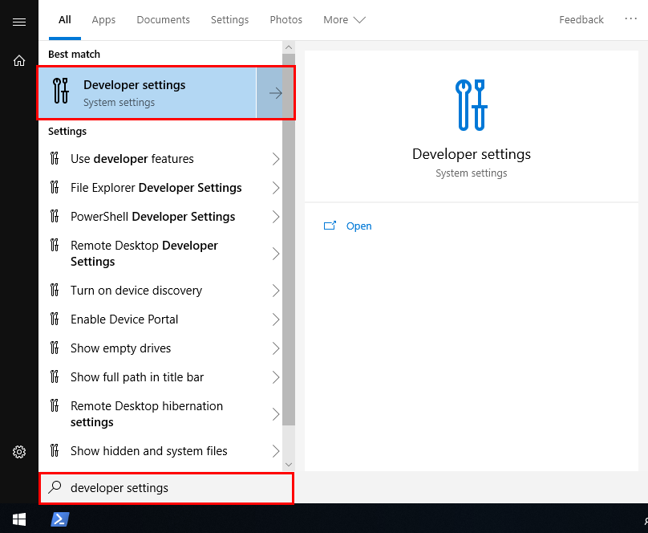
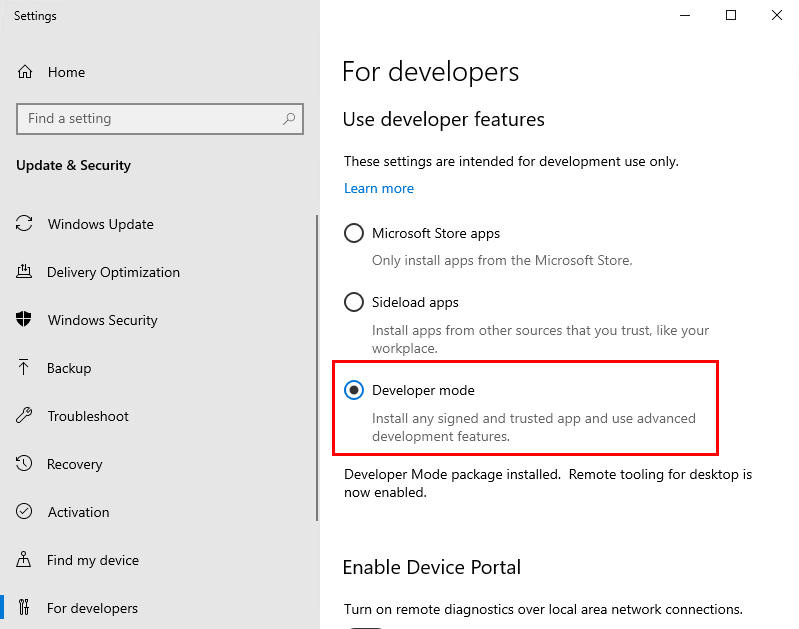
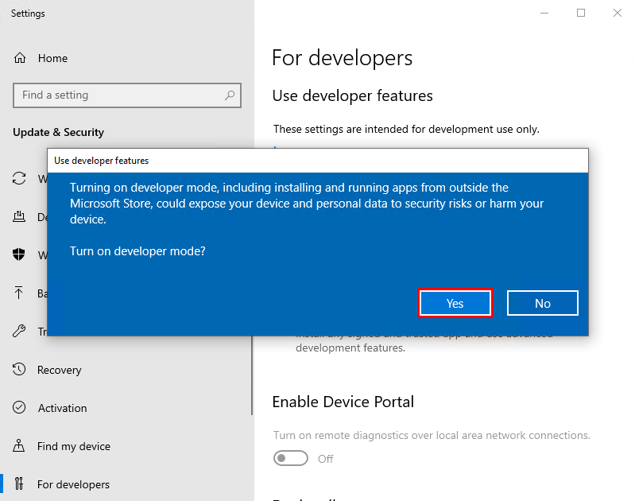
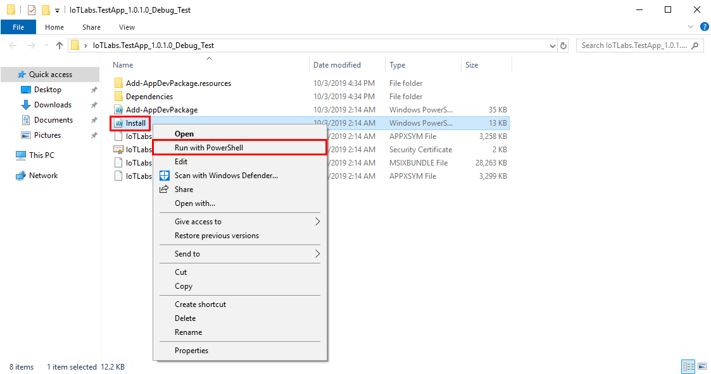
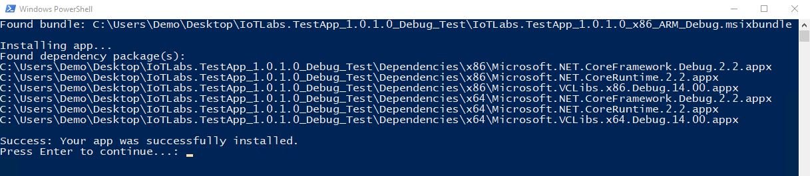
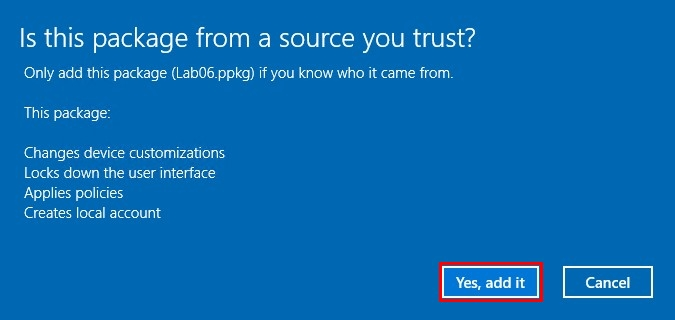
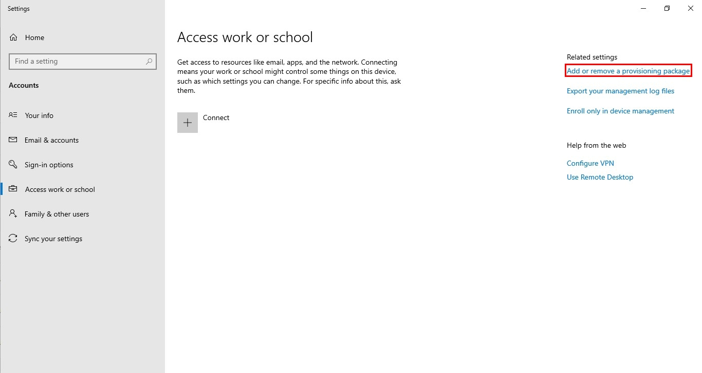
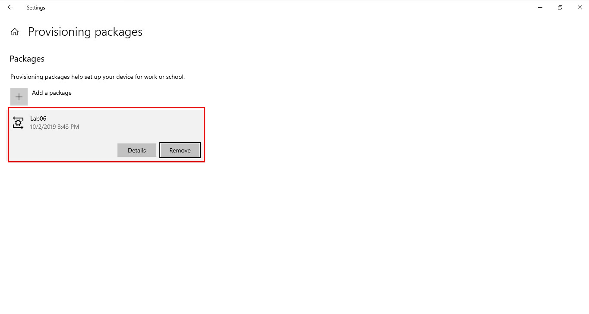

# ラボ 6 - デバイスをロックダウンされたキオスクにする

## 1 - キオスク モードで使うアプリを展開する

私たちがこれから行うように、Windows ストアで公式にリリースされていないアプリを展開するには、開発者向け機能を有効にする必要があります。これを有効化すれば、UWP (Universal Windows Platform) アプリ IoTLabs をインストールできるようになります。

### 1.1 - 開発者向け機能を有効にする

1. スタート メニューを開いて **"developer settings"** と入力し、一番上の選択肢を選びます。

2. **\[開発者モード]** トグルを選択します。  

3. **\[はい]** をクリックして、必要なパッケージのロードが終わるまで数分待ちます。  

### 1.2 - アプリケーションをインストールする

1. `C:\Labs\content\src\IoTLabs.AssignedAccess\` に移動します。

2. **IoTLabs.TestApp\_1.0.1.0\_Debug\_Test** を解凍し、解凍されたフォルダーを開きます。
**アドバイス:** .zip フォルダーを右クリックして、\[すべて展開…] を実行します。

3. **Install.ps1** という名前のファイルを右クリックして、**\[PowerShell で実行]** をクリックします。  

4. "Success:  Your app was successfully installed. (成功: アプリが正常にインストールされました。)" というメッセージを確認します。入力を促されたら、**Y** に続いて **Enter** を入力し、アプリのインストールを完了させてください。  これによって、PowerShell ウィンドウが閉じられます。

## 2\. プロビジョニング パッケージを使って "割り当てられたアクセス" を設定する

**プロビジョニング パッケージ**を使えば、設定を迅速かつ安定的に多数のデバイスへ展開できます。展開は、OOBE (Out-Of-Box Experience) の際にも、デバイスのセットアップ完了後にも実施できます。

### 2.1 - インストールする

1. `C:\Labs\Content\src\IoTLabs.AssignedAccess\` に移動します。
**アドバイス:** 前の手順の後にデバイスを再起動していない場合は、\[Windows] アイコンの横の虫眼鏡を使って "エクスプローラー" と検索し、それから C ドライブを探す必要があるかもしれません。

2. ppkg ファイル `lab06.ppkg` を開きます。このファイルは、展開する必要のある設定やファイルのすべてを含んでいるプロビジョニング パッケージです。

3. アプリケーションがデバイスに変更を加えることを許可するため、**\[はい]** をクリックします。確認を求められたら、**\[はい、追加する]** をクリックします。  

4. 何も起こっていないように見えるかもしれませんが、気にせずにコンピューターを再起動してください。

5. デバイスが、ロックダウンされたキオスク ユーザーとして自動ログインするはずです。自分のアプリケーションがフルスクリーンで起動しているのを確認できるはずです。利用者はそのアプリケーションを閉じることも、その他の Windows の機能にアクセスすることもできません。

### 2.2 - プロビジョニング パッケージを削除する

1. **Ctrl + Alt + Delete** を押します。

2. ユーザーを管理アカウントに切り替えます。そのアカウントはおそらく "LabUser" となっているはずです。ユーザー **lab.userXX@msiotlabs.com** のために使用していたパスワードを入力します。

3. **\[スタート]** > **\[設定]** > **\[アカウント]** > **\[職場または学校にアクセスする]** > **\[プロビジョニング パッケージを追加または削除する]** の順番に移動します。****

4. プロビジョニング パッケージを選んでから、**\[削除]** を選択します。アプリケーションがデバイスに変更を加えることを許可するため、**\[はい]** をクリックします。  パッケージ "Lab06" が削除されたことを確認できるはずです。