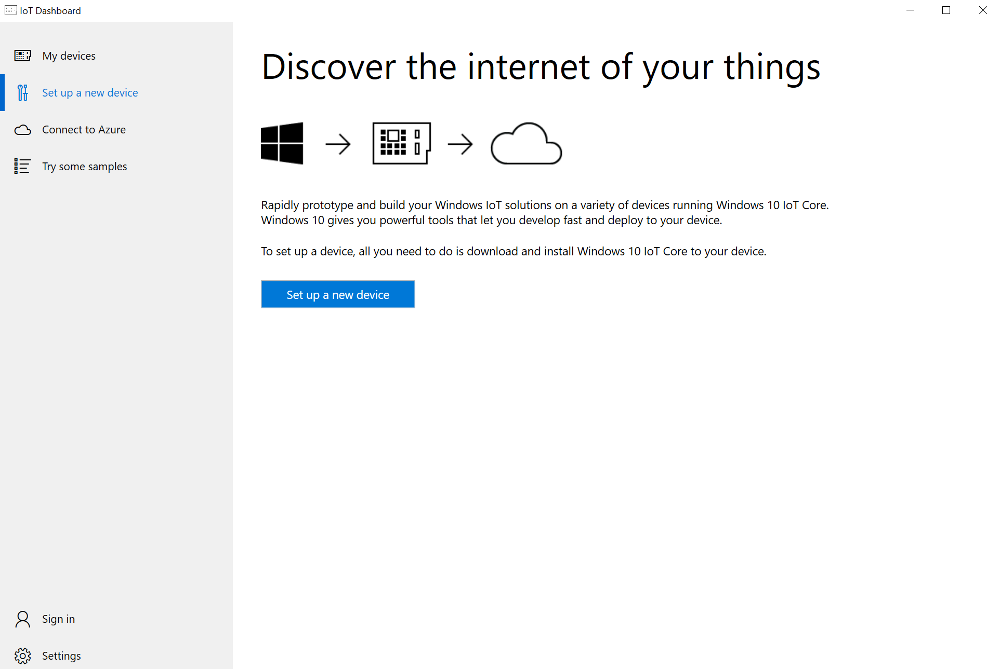
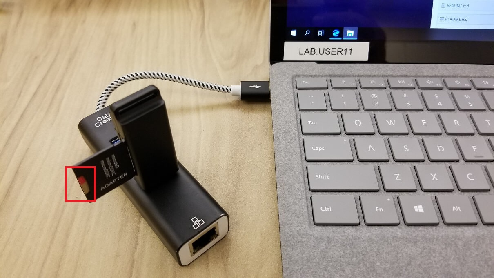
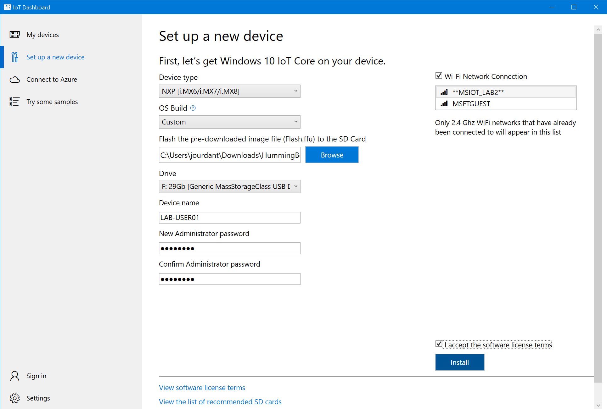
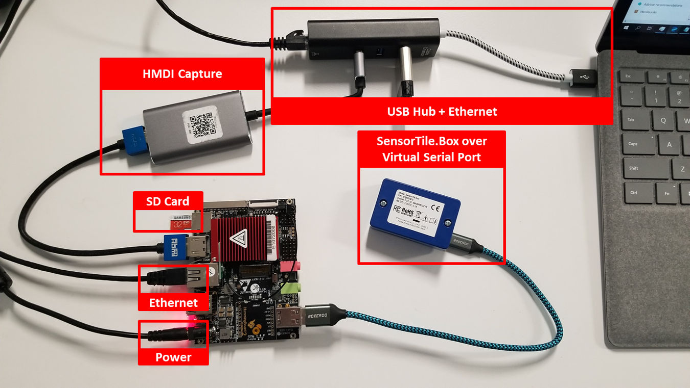
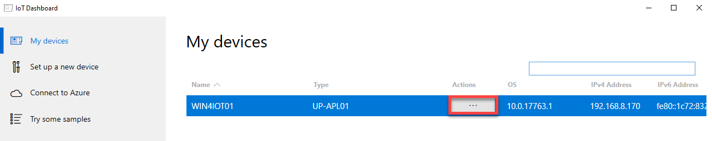
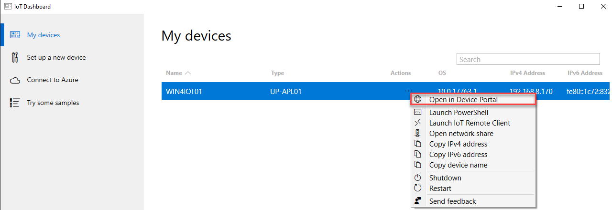
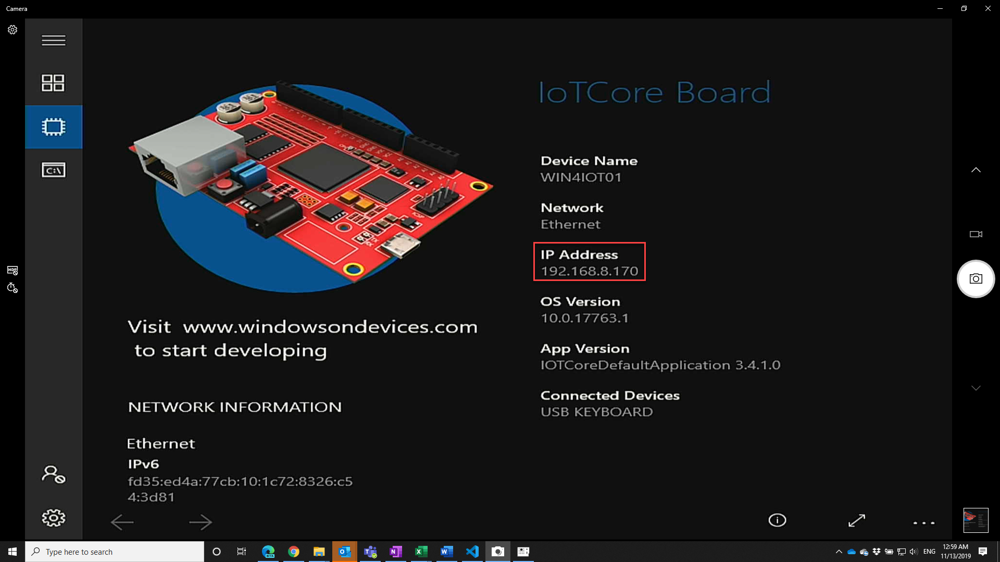
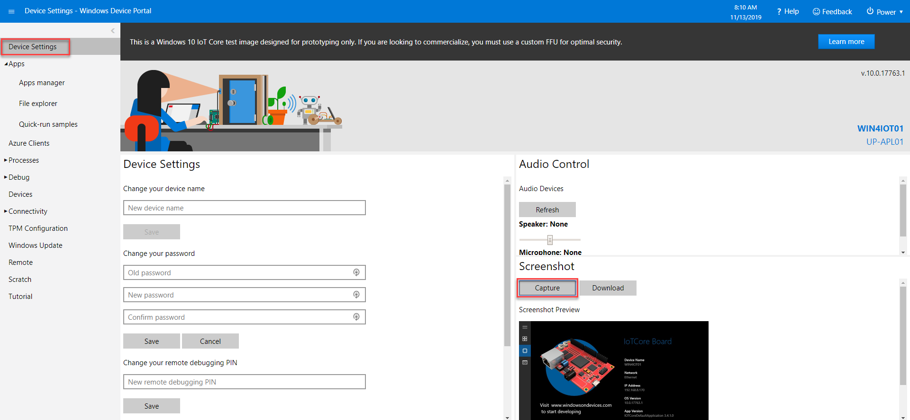
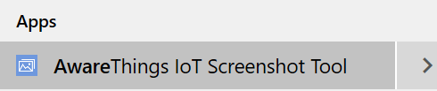
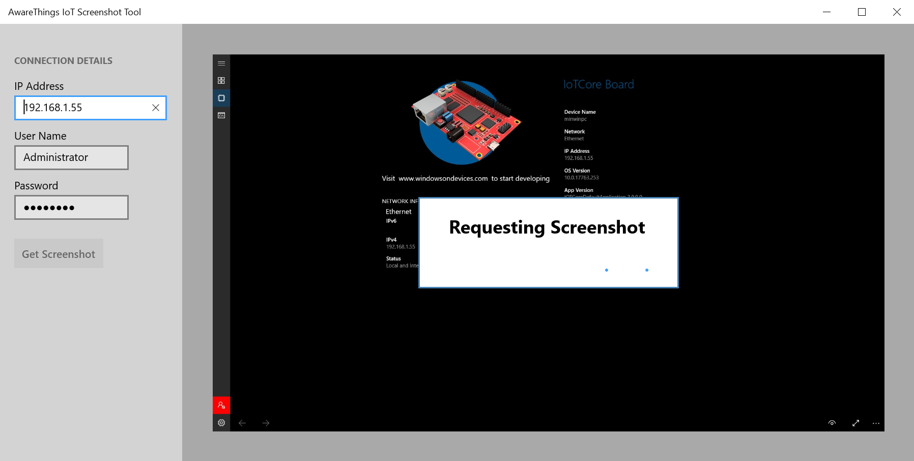

# ラボ 1a - Windows 10 IoT の利用を始める

このラボでは、SolidRun HummingBoard Edge ボード上に Windows 10 IoT Core をセットアップし、Visual Studio を使用してアプリをデプロイしていきます。

## 用意するもの

### ハードウェア

* SolidRun HummingBoard Edge
* MicroSD カードとアダプター
* STM SensorTile.Box
* 任意: USB HDMI キャプチャ カード

### ソフトウェア

* Windows 10 IoT Core ダッシュボード
* Windows 10 IoT Core ファームウェア

## 1 - IoT ダッシュボードを使って Windows 10 IoT Core をインストールする

Windows 10 IoT Core を実行するデバイスは、IoT ダッシュボードを使用してインストールおよび構成できます。このツールを使えば、使用を開始して Azure の接続を準備するのが簡単になります。

### 1.1 - IoT ダッシュボードをインストールする

1. **デスクトップ上に既に Windows 10 IoT Core ダッシュボードがインストールされている場合は、この手順をスキップして、「1.2 Windows 10 IoT Core をインストールする」に進んでください。**

2. ブラウザー ウィンドウで [http://go.microsoft.com/fwlink/?LinkID=708576](http://go.microsoft.com/fwlink/?LinkID=708576) を開いてください。これによって、ラボに必要なデータとツールをセットアップするためのファイルがインストールされます。

3. setup.exe ファイルをダブルクリックして IoT ダッシュボードを起動し、このアプリケーションが正しく開始することを確認します (以下に示す画面が表示されれば正しく機能しています)。

### 1.2 - Windows 10 IoT Core をインストールする

1. お使いの Hummingboard デバイスの電源が入っていないことを確認します。

2. マイクロ SD カードをカード リーダーに挿入します。**HummingBoard** に挿入しないようにしてください。その後、カード リーダーを PC に接続します。

3. ドライブをフォーマットするようにというメッセージが表示された場合は無視してください。ポップアップ表示されるウィンドウをすべて閉じます。

4. スタート メニューで「**iot core**」と入力して、IoT ダッシュボードを開きます。

5. **\[新しいデバイスをセットアップする]** をクリックします。

6. ドロップダウン リストを使用して、デバイスのタイプを「**NXP \[i.MX6/i.MX7/i.MX8]**」に変更し、OS のビルドを **\[カスタム]** に変更します。

7. `C:/Labs` にある FFU ファイルを参照します。

8. デバイスに「Lab-UserXX」という名前を付けます。ここで、XX は割り当てられたユーザー番号を指します  (ラボの PC 画面の左下にある番号)。

9. 新しい管理者パスワードに「p@ssw0rd」を追加し、確認のためにもう一度入力します。

10. 使用許諾契約書に同意し、**\[インストール]** をクリックします。

11. Windows エクスプローラーでドライブをフォーマットするよう求められる場合がありますが、このメッセージは無視しても問題ないため、**\[続行]** を押します。  ソフトウェアがデバイスに変更を加えることを許可するかどうかを尋ねられた場合は、許可してください。
12. マイクロ SD カードが準備を行うには数分かかる場合があります。
13. 完了したら、マイクロ SD カードをアダプターから取り出します。

### 1.3 - ハードウェアを接続する

1. マイクロ USB ケーブルを SensorTile に差し込み、もう一方の端末を HummingBoard に (PC ではなく) に接続します。

2. イーサネット ケーブルを HummingBoard に接続します。

3. マイクロ SD カードを HummingBoard に挿入します。

4. HDMI アダプターを HummingBoard に接続し、USB 側を PC に接続された USB ハブに差し込みます。

### 1.4 - デバイスを起動する

1. ラボ用の PC で、カメラ アプリケーションを開いて HummingBoard の起動時の出力を表示します。

2. カメラ アプリの右上隅にあるカメラ サイクル ボタンを選択し、キャプチャ カードを選択します。

3. 電源ケーブルを HummingBoard に挿入します。

4. HummingBoard の初期設定が開始します。

**注意:** この初期ブート プロセスは 3 ～ 5 分かかります。初期設定の実行中に、数回再起動する場合があります。起動中にさまざまな画面が表示されますが、次の画面に移る前に 1 分程度かかる場合があります。このプロセス中に Windows ロゴが表示されれば、順調に進行しています。OOBE (Out of Box Experience) に達したら、続行することができます。

**注意: 画面、マウス、またはキーボードを使用して、IoT Core と対話することはできません。これは、ラボ用 PC に表示されている HDMI ディスプレイに過ぎません。この設定にはユーザー入力は必要ありません。OOBE 画面を介して自動的に順を追って実行されます。**

**アドバイス:** 順番を間違えた場合は、HummingBoard の電源ケーブルを抜いてもう一度差し込んでデバイスを再起動し、ディスプレイがカメラ アプリにキャプチャされるようにします。

### 1.5 - インストールを検証する

1. HummingBoard の起動が完了したら、IoT ダッシュボードにライン項目が表示されます。このウィンドウを開いたままにして、デバイスの準備ができた場合に通知が表示されるようにできます。

2. デバイスを右クリックして、**\[デバイス ポータルで開く]** を選択します。

**注意:** デバイスがリストに表示されない場合、デバイスの HDMI 出力を見て、それが完全に起動されていることを確認し、ディスプレイから IP アドレスを読み取ってそれをポート 8080 上のブラウザーに入力します。例えば、「http://192.168.1.40:8080」のように入力します。

3. ブラウザーに、上記で設定した既定のユーザー名とパスワードを入力します。

| 名前| 値
|----------|----------
| ユーザー名| Administrator
| パスワード| p@ssw0rd

これで、Windows 10 IoT Core がインストールされた IoT デバイスが正常に動作し、画面出力がセカンド スクリーンとして機能する Windows カメラに HDMI キャプチャ カードを介して表示されているはずです。

次に、UWP ゲートウェイ アプリケーションのデプロイに進むことができます。

ラボ 1b [アプリをサイドローディングによってデバイスにデプロイする](./Lab01b_Install_Gateway_Software.md)

または

ラボ 1c [アプリを Visual Studio でデバイスにデプロイする](./Lab01c.md)

## ディスプレイのトラブルシューティング

1. HDMI キャプチャ カードに問題がある場合は、IoT デバイスの画面上のものを確認する別の方法として、Windows デバイス ポータルの組み込みの**スクリーンショット**コマンドを使用できます。

2. Windows デバイス ポータルの **\[デバイス設定]** を選択し、右下の **\[スクリーンショット]** ボタンを押します。1 回目で壊れた画像のアイコンが表示される場合はもう一度試してください。

3. スクリーンショットを撮るのに使用できるもう 1 つのツールがラボ用 PC にインストールされています。PC のスタート メニューに「Aware」と入力して、スクリーンショット ツールを選択します。

4. IP アドレスを入力して、\[Get Screenshot] を選択します。必要に応じて更新して、デバイス画面上にあるものの更新されたイメージを表示します。