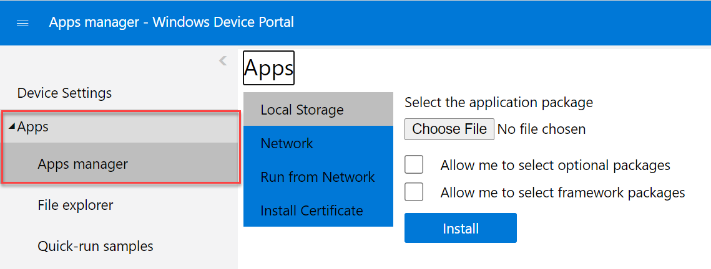
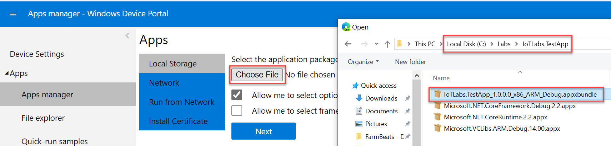
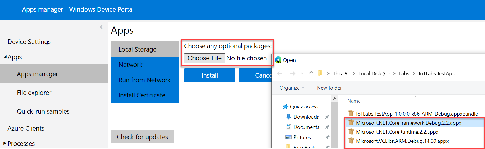
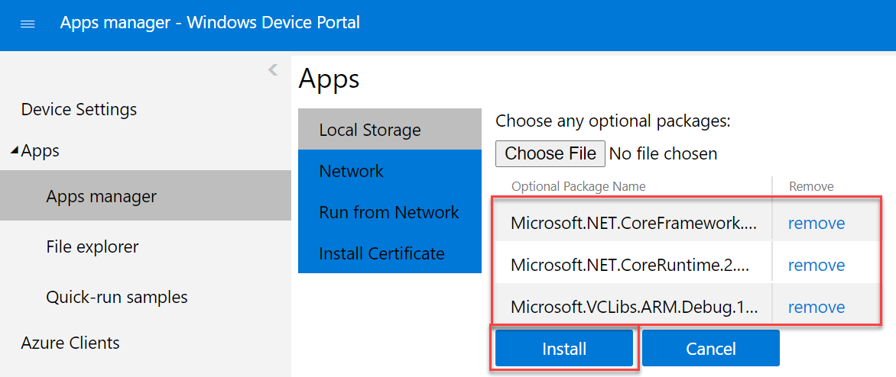
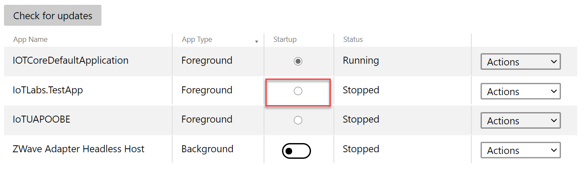
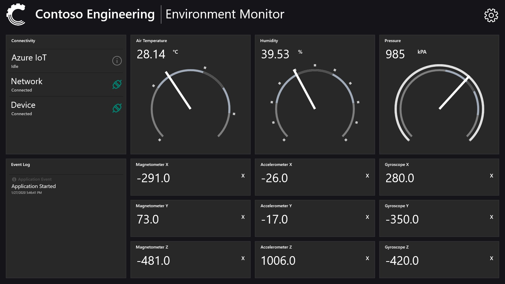
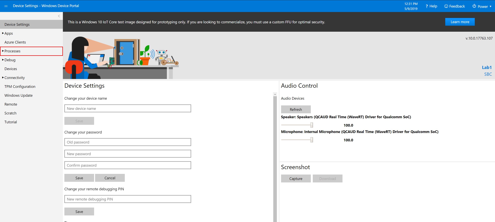
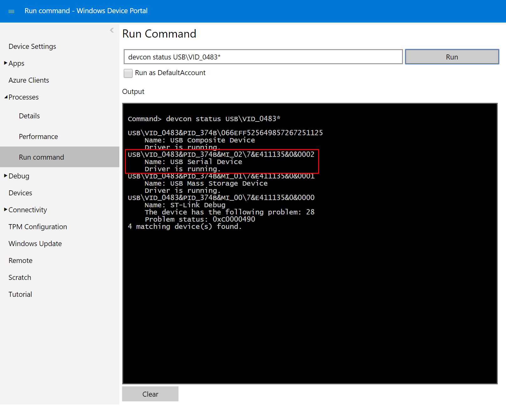
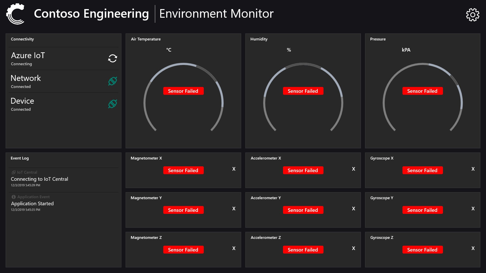
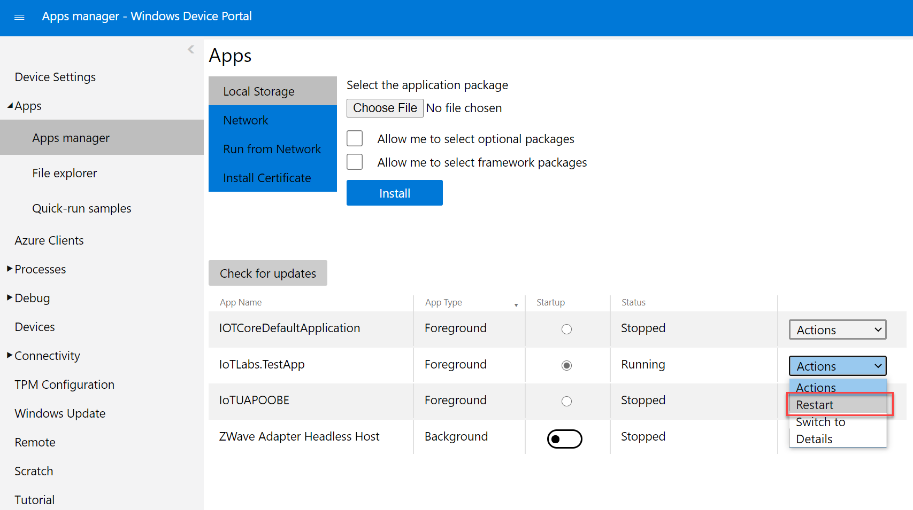

# ラボ 1b - センサー ゲートウェイ アプリケーション ソフトウェアをインストールする

-------------------------------------------------

センサー アプリケーションとは、センサーから値を読み取り、それをクラウドに送信するソフトウェアです。センサー アプリケーションは、デバイスからのデータを Azure IoT Central に供給するために不可欠です。

## 準備

下記のインストール ガイドを読み進める前に、デバイスがインターネットに接続されており、デバイスの IP アドレスを取得していることを確認してください。

**Windows デバイス ポータルでアプリ マネージャーを開く**

1. Windows デバイス ポータルを開きます。これは、Web ブラウザーを開き、デバイスの IP アドレス (以前のステップ バイ ステップの手順で確認) を入力します。このアドレスの後に「8080」が続きます (例: http://192.168.1.60:8080)。

2. Windows デバイス ポータルで、左側のメニューから **\[Apps]** を選択し、次に **\[App manager]** を選択します。

**センサー アプリケーション ソフトウェアをインストールする**

1. **\[Choose File]** で **\[Select the application package]** ボタンを選択します。

2. **C:\\Labs\\IoTLabs.TestApp** でダウンロードされたファイルの場所を参照し、「**IoTLabs.TestApp**」で始まり、「**msixbundle**」で終わるファイルを選択します。

3. **\[Allow me to select optional packages]** を選択し、**\[Next]** をクリックします。

4. **\[Choose File]** ボタンを選択して、「Microsoft.NET.CoreFramework.Debug.2.2.appx」を選択します。

5. **\[Choose File]** ボタンを選択して、「Microsoft.NET.CoreRuntime2.2.appx」を選択します。

6. **\[Choose File]** ボタンを選択して、「Microsoft.VCLibs.ARM.Debug.14.00.appx」を選択します。

7. **\[Install]** ボタンをクリックします。

8. アプリケーションでアップロードを行うのに少し時間がかかり、その後インストールのために一時停止します。インストールが終了すると、**「Package Successfully Registered」**というメッセージが最後に表示されます。

9. ****\[Done]**** をクリックします。

10. このアプリケーションがアプリ リストに表示されているはずです。

11. これで、デバイスの起動時にアプリが開始するよう選択できます。

12. ラボ用のPC でカメラ アプリを表示するか、Windows デバイス ポータルでスクリーンショットを撮って、アプリケーションが開始することを確認します。

## ソフトウェアのインストールの完了

Windows 10 IoT Core センサー デバイスおよびソフトウェアが正常にインストールされました。

アプリケーションが正常に読み込まれると、画面上にセンサー データが表示されるはずです。センサーに赤い線が表示されている場合、センサーの電源プラグを抜いて、もう一度差し込んでください。

次に、「**ラボ 2 – デバイスを Azure IoT Central** **に接続する** ([デバイスを Azure IoT Central に接続する)](./02_Lab02.md)」に進みます。

## SensorTile のトラブルシューティング

1. SensorTile が接続されていることを確認します。それが Hummingboard に接続されていることを確認し、\[Processes] メニューを開き、\[Run command] を選択します。

2. **「devcon status USB\\VID\_0483\*」**を入力して、Enter キーを押して、デバイスが接続された SensorTile を認識できているかどうかを確認します。

3. 「**Name: USB Serial Device**」が「Running」のステータスで表示されているはずです。

4. センサーにまだ赤い線が表示されている場合は、Windows デバイス ポータルのアプリ マネージャーを使用してアプリケーションを再起動してください。 