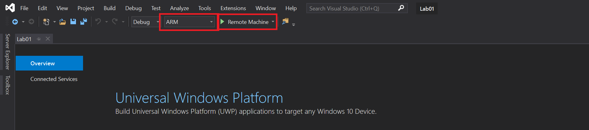
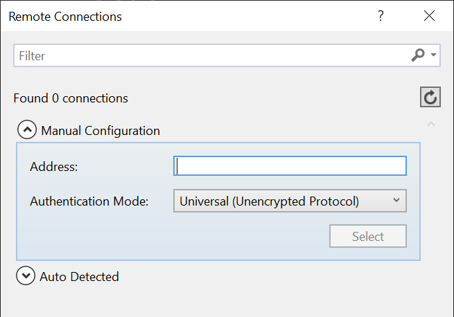
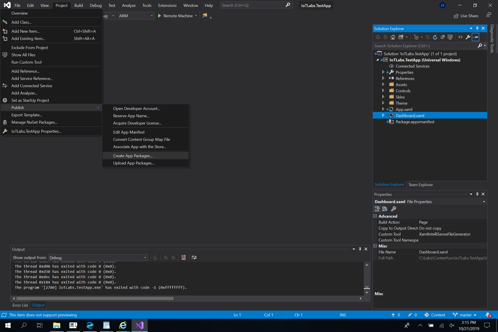
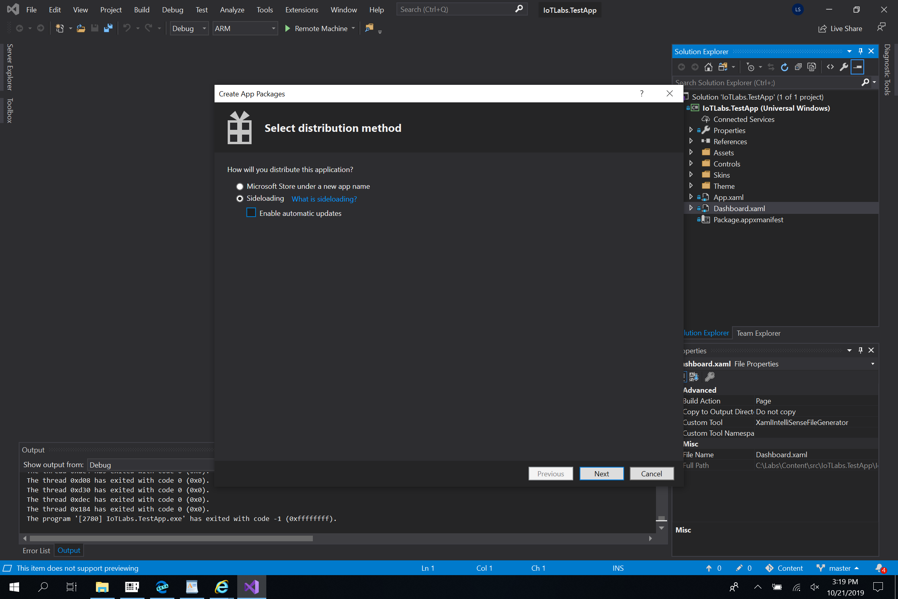
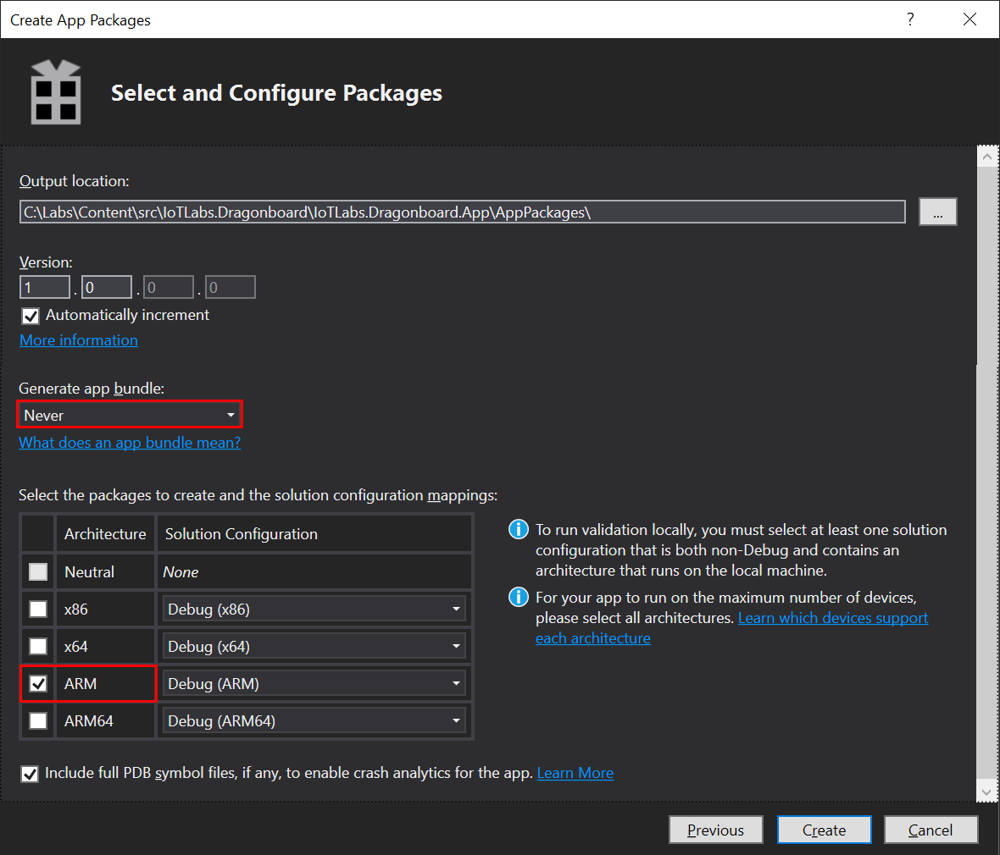
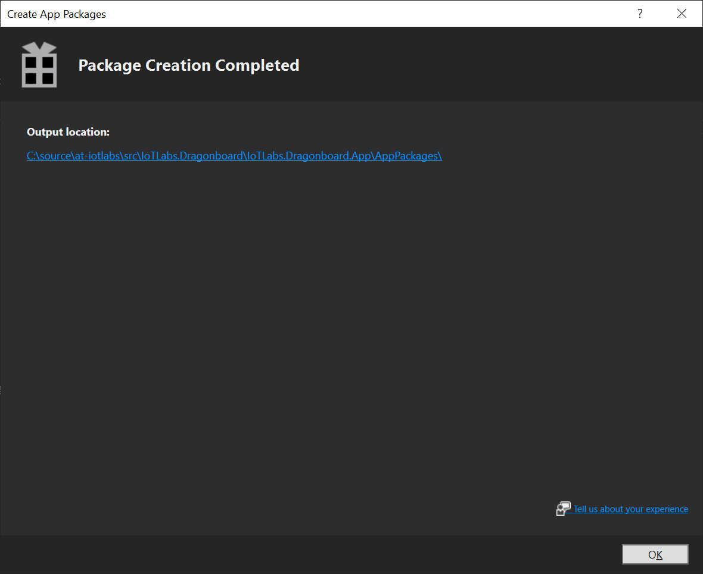

# ラボ -01c - アプリを Visual Studio でデバイスにデプロイする

## 1 - Visual Studio 2019 でデプロイおよびデバッグする

1. [C:\\Labs\\content\\src\\IoTLabs.TestApp\\IoTLabs.TestApp.sln](file:///C:\Labs\content\src\IoTLabs.TestApp\IoTLabs.TestApp.sln)にある最初のラボ プロジェクトを開きます。

2. VisualStudio でログインするようプロンプトが表示された場合は、サインインは必要ではないため、ウィンドウを閉じてかまいません。

3. ターゲット システム アーキテクチャを更新して、下図に示すように「ARM」が表示されるようにします。

4. ターゲット システムを「Device」から「Remote Machine」に変更して、HummingBoard デバイスの IP アドレスを入力します。これは、HummingBoard デバイスを表示するカメラの画面上にあります。既に **\[自動検出]** にリストされている場合があります。

5. 再び VisualStudio でプロジェクトを実行し (\[リモート マシン] の横にある緑色の矢印を押すことで実行)、それを HummingBoard 上でテストします。

**注意:** 最初のデプロイには数分かかる場合があります。  アプリの左下隅にあるステータス メッセージに「準備完了」と表示されていれば、完了したことがわかります。その後、HummingBoard 上でアプリを起動してください。

**アドバイス:** センサー データが表示されていない場合、SensorTile が接続されている USB ポートを、HummingBoard 上の別のポートに変更してみてください。\[停止] ボタンを使用して Visual Studio 内のアプリケーションを停止し、次に再度 \[開始] ボタンを押します。

## 2 - サイドローディングのためにアプリを .appx バンドルとして公開する

1. Visual Studio の \[ソリューション エクスプローラー] タブで、\[Dashboard.xaml] をクリックします。

2. `Project > Publish > Create App Packages...`をクリックします。

3. **\[サイドローディング]** を選択してアプリケーションを配布するよう選択し、\[自動更新を有効にする] のチェックをオフにします。  **\[次へ]** をクリックし、\[Select signing method] を既定のままにして、再度 **\[次へ]** をクリックします。

4. \[アプリ バンドルの生成] で \[しない] を選択し、アーキテクチャとして \[ARM] を選択します。  

5. パッケージの作成が完了したら、リンクをクリックして .appx ファイルが作成されたことを確認します。

Appx ファイルが作成されたことを確認したら、次のラボ「[2 - Windows IoT を Azure と統合する](./Lab02.md)」に進むことができます。 